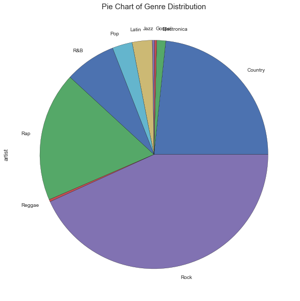
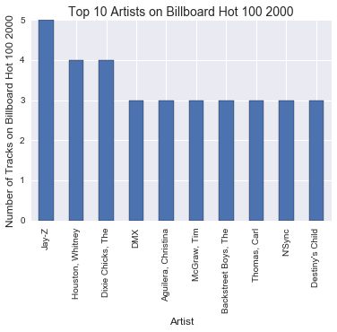
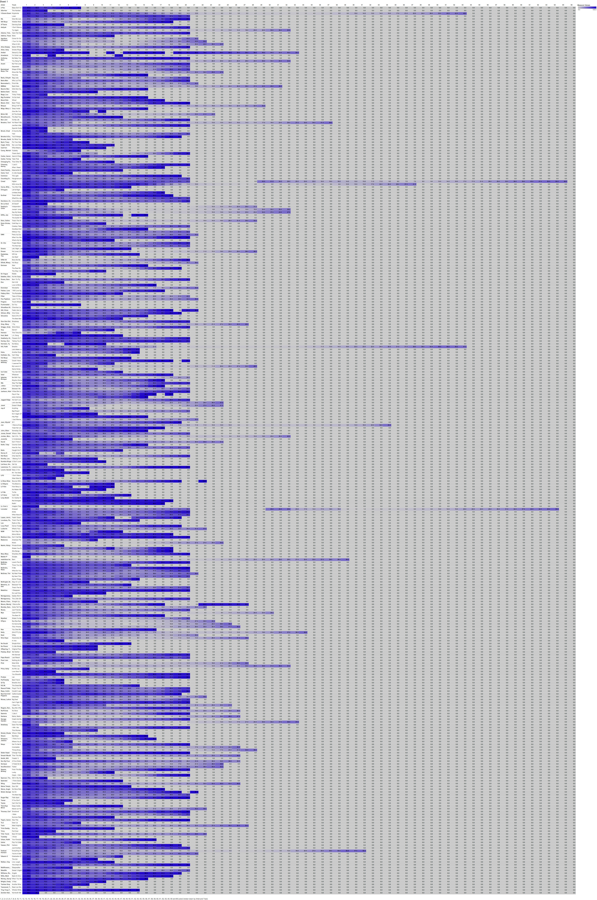
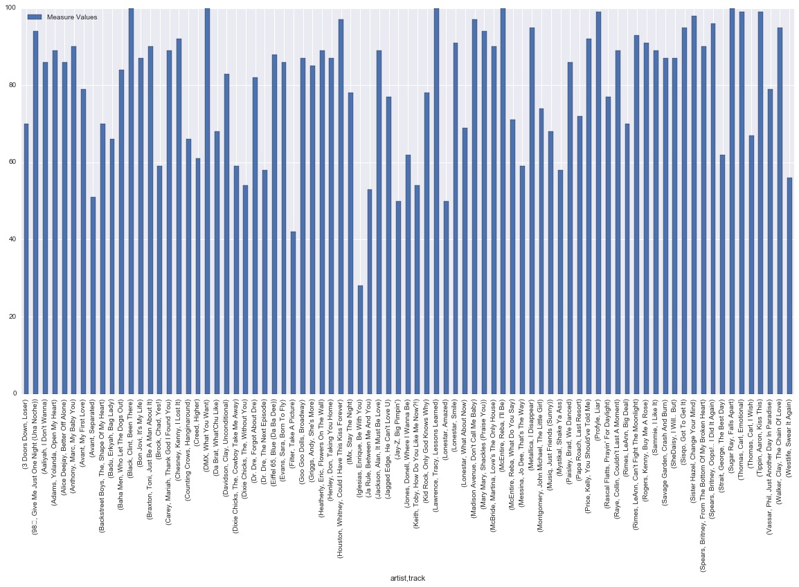
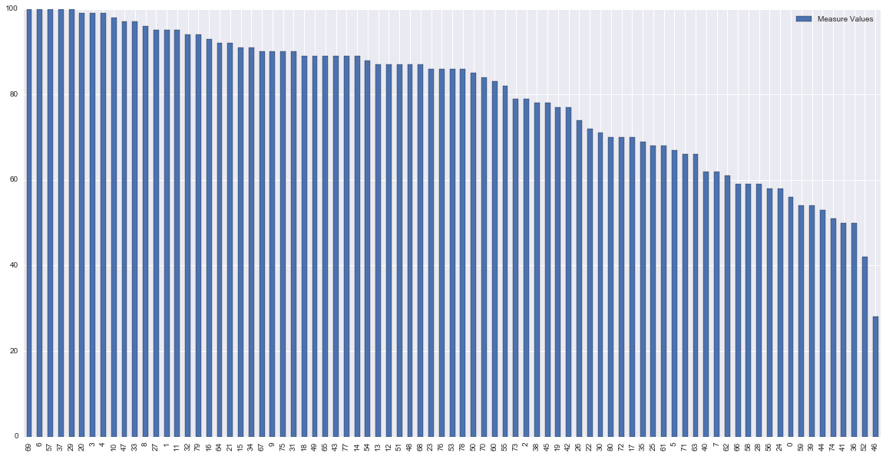

# Project 2
## The Last Step:

### Summary

I'll begin this project with the end in mind. This project disects the way Billboard celebrates fresh music of the new millenium. The data set provided detailed the artist, tracks, track lengths, debut date, peak date, and the subsequent weekly rankings of the tracks that made it on to Billboard's Hot 100 list of the year 2000.

Divided into 5 sections, this investigation starts with loading, reading, and exploring the dataset from a CSV file on Jupyter notebook. 

1) Exploring the Data

I did some basic research on what the dataset actually represented and also had a brief glance at the dataset by running the typical screening commands, such as .head(), .tail(), .describe(), .shape, etc, which gave me the following insights as described above:

"The Billboard Hot 100 is the music industry standard record chart in the United States for singles, published weekly by Billboard magazine. Chart rankings are based on radio play, online streaming, and sales (physical and digital)." - Wikipedia

The data corresponds to The Billboard Hot 100 for the year of 2000.

- The dataframe is made up of year, name of artist, debut date, peak date, the subsequent weekly rankings.

- There are 317 rows and 82 columns.
    
- The data has a combination of floats, integers, and objects.

- Each track has a corresponding debut and peaked date that is relative to the subsequent weekly ranking columns.

- The number of tracks that remain on the Billboard Hot 100 list decreases as the weeks go on.\

- There are no tracks that remain after the 65th week of being on the billboard list.

- The highest first-week ranking is 15 and the lowest first-week ranking is 100.

- The standard deviation of the weekly rankings decrease as the weeks go on.

2) Cleaning:


The second step was rudimentary cleaning of the dataset, getting rid of the null values, taking out columns and rows that were unnecessary, and altering the types of values to make further analysis easier.

3) Visualizing:


Here are a few ways I visualized the data...
This pie chart shows the distribution of genres within the Billboard Hot 100 List of 2000.
 

This bar graph shows the top 10 artists who frequent the chart the most that year.


I generated this visual with Tableau to demonstrate the fluctuation of rankings for each song. The darker the color, the lower rank the track is for that particular week. The lighter the color, the higher rank the track is. This shows the progression of the tracks throughout the weeks. It also highlights the stark cut-off point at the 20th week, which led to further investiation of the chart's rubric. I found out that Billboard removes tracks that are descending in rank and fall below the 25th rank mark after their 20th week of remaining on the charts. This filters out around 26% of the tracks.


This graph isolates the 81 tracks that were disqualified due to the rule stated above after their 20th week and the measures are the rank positions they held for their 20th week. The maximum is 100 and the minimum is 28, just short of the requirement.


4) Problem Statement:

I found extra datasets on Billboard's annual end of the year top 100 list of 2000 and also Billboard's annual awards of 2000 online (Billboard), which inspired me to ask the question - Are there any correlations or relationship between the Billboard Hot 100 list, Billboard's end of the year top 100 list, and Billboard's annual awards list of the year 2000? Can these possible relationships also apply to other years' data as well?

5) Brainstorm:


To figure out if a correlation or correlations exist, I would do various t-tests to compare the data. I would set the null hypothesis to say that there is no correlation between the three charts and the alternative hypothesis to say that there is a correlation or correlations between the three datasets. I would run a t-test to validate the decision on whether or not I can reject or not reject the null hypothesis and draw insights from the results.

Further research and analysis should be done to continue this investigation.

Interesting Resources:
https://www.statista.com/chart/1075/the-digital-music-revolution/

https://www.nextbigsound.com/industry-report/2016

Resources:
http://www.billboard.com/biz/billboard-charts-legend

http://www.billboard.com/archive/charts/2000/hot-100

http://www.infoplease.com/ipa/A0878624.html

https://en.wikipedia.org/wiki/Billboard_Hot_100
    
https://en.wikipedia.org/wiki/List_of_Billboard_Hot_100_number-one_singles_of_the_2000s


Please find my entire work process on Jupyter notebook below:


## Step 1: Exploring your data.

##### Load your data in using Pandas and start to explore. Save all of your early exploration code here and include in your final submission.


```python
import pandas as pd
import numpy as np
import matplotlib.pyplot as plt
import seaborn as sns
from datetime import timedelta
from IPython.display import display
from IPython.display import Image

%matplotlib inline

df0 = pd.read_csv('/Users/JHYL/DSI-HK-1/projects/project-02/assets/billboard.csv', header=0, na_values=['NA'], index_col=0, parse_dates=True)

df0
```


<div>
<table border="1" class="dataframe">
  <thead>
    <tr style="text-align: right;">
      <th></th>
      <th>artist.inverted</th>
      <th>track</th>
      <th>time</th>
      <th>genre</th>
      <th>date.entered</th>
      <th>date.peaked</th>
      <th>x1st.week</th>
      <th>x2nd.week</th>
      <th>x3rd.week</th>
      <th>x4th.week</th>
      <th>...</th>
      <th>x67th.week</th>
      <th>x68th.week</th>
      <th>x69th.week</th>
      <th>x70th.week</th>
      <th>x71st.week</th>
      <th>x72nd.week</th>
      <th>x73rd.week</th>
      <th>x74th.week</th>
      <th>x75th.week</th>
      <th>x76th.week</th>
    </tr>
    <tr>
      <th>year</th>
      <th></th>
      <th></th>
      <th></th>
      <th></th>
      <th></th>
      <th></th>
      <th></th>
      <th></th>
      <th></th>
      <th></th>
      <th></th>
      <th></th>
      <th></th>
      <th></th>
      <th></th>
      <th></th>
      <th></th>
      <th></th>
      <th></th>
      <th></th>
      <th></th>
    </tr>
  </thead>
  <tbody>
    <tr>
      <th>2000-01-01</th>
      <td>Destiny's Child</td>
      <td>Independent Women Part I</td>
      <td>3:38</td>
      <td>Rock</td>
      <td>2000-09-23</td>
      <td>2000-11-18</td>
      <td>78</td>
      <td>63.0</td>
      <td>49.0</td>
      <td>33.0</td>
      <td>...</td>
      <td>NaN</td>
      <td>NaN</td>
      <td>NaN</td>
      <td>NaN</td>
      <td>NaN</td>
      <td>NaN</td>
      <td>NaN</td>
      <td>NaN</td>
      <td>NaN</td>
      <td>NaN</td>
    </tr>
    <tr>
      <th>2000-01-01</th>
      <td>Santana</td>
      <td>Maria, Maria</td>
      <td>4:18</td>
      <td>Rock</td>
      <td>2000-02-12</td>
      <td>2000-04-08</td>
      <td>15</td>
      <td>8.0</td>
      <td>6.0</td>
      <td>5.0</td>
      <td>...</td>
      <td>NaN</td>
      <td>NaN</td>
      <td>NaN</td>
      <td>NaN</td>
      <td>NaN</td>
      <td>NaN</td>
      <td>NaN</td>
      <td>NaN</td>
      <td>NaN</td>
      <td>NaN</td>
    </tr>
    <tr>
      <th>2000-01-01</th>
      <td>Savage Garden</td>
      <td>I Knew I Loved You</td>
      <td>4:07</td>
      <td>Rock</td>
      <td>1999-10-23</td>
      <td>2000-01-29</td>
      <td>71</td>
      <td>48.0</td>
      <td>43.0</td>
      <td>31.0</td>
      <td>...</td>
      <td>NaN</td>
      <td>NaN</td>
      <td>NaN</td>
      <td>NaN</td>
      <td>NaN</td>
      <td>NaN</td>
      <td>NaN</td>
      <td>NaN</td>
      <td>NaN</td>
      <td>NaN</td>
    </tr>
    <tr>
      <th>2000-01-01</th>
      <td>Madonna</td>
      <td>Music</td>
      <td>3:45</td>
      <td>Rock</td>
      <td>2000-08-12</td>
      <td>2000-09-16</td>
      <td>41</td>
      <td>23.0</td>
      <td>18.0</td>
      <td>14.0</td>
      <td>...</td>
      <td>NaN</td>
      <td>NaN</td>
      <td>NaN</td>
      <td>NaN</td>
      <td>NaN</td>
      <td>NaN</td>
      <td>NaN</td>
      <td>NaN</td>
      <td>NaN</td>
      <td>NaN</td>
    </tr>
    <tr>
      <th>2000-01-01</th>
      <td>Aguilera, Christina</td>
      <td>Come On Over Baby (All I Want Is You)</td>
      <td>3:38</td>
      <td>Rock</td>
      <td>2000-08-05</td>
      <td>2000-10-14</td>
      <td>57</td>
      <td>47.0</td>
      <td>45.0</td>
      <td>29.0</td>
      <td>...</td>
      <td>NaN</td>
      <td>NaN</td>
      <td>NaN</td>
      <td>NaN</td>
      <td>NaN</td>
      <td>NaN</td>
      <td>NaN</td>
      <td>NaN</td>
      <td>NaN</td>
      <td>NaN</td>
    </tr>
    <tr>
      <th>2000-01-01</th>
      <td>Janet</td>
      <td>Doesn't Really Matter</td>
      <td>4:17</td>
      <td>Rock</td>
      <td>2000-06-17</td>
      <td>2000-08-26</td>
      <td>59</td>
      <td>52.0</td>
      <td>43.0</td>
      <td>30.0</td>
      <td>...</td>
      <td>NaN</td>
      <td>NaN</td>
      <td>NaN</td>
      <td>NaN</td>
      <td>NaN</td>
      <td>NaN</td>
      <td>NaN</td>
      <td>NaN</td>
      <td>NaN</td>
      <td>NaN</td>
    </tr>
    <tr>
      <th>2000-01-01</th>
      <td>Destiny's Child</td>
      <td>Say My Name</td>
      <td>4:31</td>
      <td>Rock</td>
      <td>1999-12-25</td>
      <td>2000-03-18</td>
      <td>83</td>
      <td>83.0</td>
      <td>44.0</td>
      <td>38.0</td>
      <td>...</td>
      <td>NaN</td>
      <td>NaN</td>
      <td>NaN</td>
      <td>NaN</td>
      <td>NaN</td>
      <td>NaN</td>
      <td>NaN</td>
      <td>NaN</td>
      <td>NaN</td>
      <td>NaN</td>
    </tr>
    <tr>
      <th>2000-01-01</th>
      <td>Iglesias, Enrique</td>
      <td>Be With You</td>
      <td>3:36</td>
      <td>Latin</td>
      <td>2000-04-01</td>
      <td>2000-06-24</td>
      <td>63</td>
      <td>45.0</td>
      <td>34.0</td>
      <td>23.0</td>
      <td>...</td>
      <td>NaN</td>
      <td>NaN</td>
      <td>NaN</td>
      <td>NaN</td>
      <td>NaN</td>
      <td>NaN</td>
      <td>NaN</td>
      <td>NaN</td>
      <td>NaN</td>
      <td>NaN</td>
    </tr>
    <tr>
      <th>2000-01-01</th>
      <td>Sisqo</td>
      <td>Incomplete</td>
      <td>3:52</td>
      <td>Rock</td>
      <td>2000-06-24</td>
      <td>2000-08-12</td>
      <td>77</td>
      <td>66.0</td>
      <td>61.0</td>
      <td>61.0</td>
      <td>...</td>
      <td>NaN</td>
      <td>NaN</td>
      <td>NaN</td>
      <td>NaN</td>
      <td>NaN</td>
      <td>NaN</td>
      <td>NaN</td>
      <td>NaN</td>
      <td>NaN</td>
      <td>NaN</td>
    </tr>
    <tr>
      <th>2000-01-01</th>
      <td>Lonestar</td>
      <td>Amazed</td>
      <td>4:25</td>
      <td>Country</td>
      <td>1999-06-05</td>
      <td>2000-03-04</td>
      <td>81</td>
      <td>54.0</td>
      <td>44.0</td>
      <td>39.0</td>
      <td>...</td>
      <td>NaN</td>
      <td>NaN</td>
      <td>NaN</td>
      <td>NaN</td>
      <td>NaN</td>
      <td>NaN</td>
      <td>NaN</td>
      <td>NaN</td>
      <td>NaN</td>
      <td>NaN</td>
    </tr>
    <tr>
      <th>2000-01-01</th>
      <td>N'Sync</td>
      <td>It's Gonna Be Me</td>
      <td>3:10</td>
      <td>Rock</td>
      <td>2000-05-06</td>
      <td>2000-07-29</td>
      <td>82</td>
      <td>70.0</td>
      <td>51.0</td>
      <td>39.0</td>
      <td>...</td>
      <td>NaN</td>
      <td>NaN</td>
      <td>NaN</td>
      <td>NaN</td>
      <td>NaN</td>
      <td>NaN</td>
      <td>NaN</td>
      <td>NaN</td>
      <td>NaN</td>
      <td>NaN</td>
    </tr>
    <tr>
      <th>2000-01-01</th>
      <td>Aguilera, Christina</td>
      <td>What A Girl Wants</td>
      <td>3:18</td>
      <td>Rock</td>
      <td>1999-11-27</td>
      <td>2000-01-15</td>
      <td>71</td>
      <td>51.0</td>
      <td>28.0</td>
      <td>18.0</td>
      <td>...</td>
      <td>NaN</td>
      <td>NaN</td>
      <td>NaN</td>
      <td>NaN</td>
      <td>NaN</td>
      <td>NaN</td>
      <td>NaN</td>
      <td>NaN</td>
      <td>NaN</td>
      <td>NaN</td>
    </tr>
    <tr>
      <th>2000-01-01</th>
      <td>Vertical Horizon</td>
      <td>Everything You Want</td>
      <td>4:01</td>
      <td>Rock</td>
      <td>2000-01-22</td>
      <td>2000-07-15</td>
      <td>70</td>
      <td>61.0</td>
      <td>53.0</td>
      <td>46.0</td>
      <td>...</td>
      <td>NaN</td>
      <td>NaN</td>
      <td>NaN</td>
      <td>NaN</td>
      <td>NaN</td>
      <td>NaN</td>
      <td>NaN</td>
      <td>NaN</td>
      <td>NaN</td>
      <td>NaN</td>
    </tr>
    <tr>
      <th>2000-01-01</th>
      <td>Creed</td>
      <td>With Arms Wide Open</td>
      <td>3:52</td>
      <td>Rock</td>
      <td>2000-05-13</td>
      <td>2000-11-11</td>
      <td>84</td>
      <td>78.0</td>
      <td>76.0</td>
      <td>74.0</td>
      <td>...</td>
      <td>NaN</td>
      <td>NaN</td>
      <td>NaN</td>
      <td>NaN</td>
      <td>NaN</td>
      <td>NaN</td>
      <td>NaN</td>
      <td>NaN</td>
      <td>NaN</td>
      <td>NaN</td>
    </tr>
    <tr>
      <th>2000-01-01</th>
      <td>Aaliyah</td>
      <td>Try Again</td>
      <td>4:03</td>
      <td>Rock</td>
      <td>2000-03-18</td>
      <td>2000-06-17</td>
      <td>59</td>
      <td>53.0</td>
      <td>38.0</td>
      <td>28.0</td>
      <td>...</td>
      <td>NaN</td>
      <td>NaN</td>
      <td>NaN</td>
      <td>NaN</td>
      <td>NaN</td>
      <td>NaN</td>
      <td>NaN</td>
      <td>NaN</td>
      <td>NaN</td>
      <td>NaN</td>
    </tr>
    <tr>
      <th>2000-01-01</th>
      <td>matchbox twenty</td>
      <td>Bent</td>
      <td>4:12</td>
      <td>Rock</td>
      <td>2000-04-29</td>
      <td>2000-07-22</td>
      <td>60</td>
      <td>37.0</td>
      <td>29.0</td>
      <td>24.0</td>
      <td>...</td>
      <td>NaN</td>
      <td>NaN</td>
      <td>NaN</td>
      <td>NaN</td>
      <td>NaN</td>
      <td>NaN</td>
      <td>NaN</td>
      <td>NaN</td>
      <td>NaN</td>
      <td>NaN</td>
    </tr>
    <tr>
      <th>2000-01-01</th>
      <td>Carey, Mariah</td>
      <td>Thank God I Found You</td>
      <td>4:14</td>
      <td>Rock</td>
      <td>1999-12-11</td>
      <td>2000-02-19</td>
      <td>82</td>
      <td>68.0</td>
      <td>50.0</td>
      <td>50.0</td>
      <td>...</td>
      <td>NaN</td>
      <td>NaN</td>
      <td>NaN</td>
      <td>NaN</td>
      <td>NaN</td>
      <td>NaN</td>
      <td>NaN</td>
      <td>NaN</td>
      <td>NaN</td>
      <td>NaN</td>
    </tr>
    <tr>
      <th>2000-01-01</th>
      <td>Hill, Faith</td>
      <td>Breathe</td>
      <td>4:04</td>
      <td>Rap</td>
      <td>1999-11-06</td>
      <td>2000-04-22</td>
      <td>81</td>
      <td>68.0</td>
      <td>62.0</td>
      <td>51.0</td>
      <td>...</td>
      <td>NaN</td>
      <td>NaN</td>
      <td>NaN</td>
      <td>NaN</td>
      <td>NaN</td>
      <td>NaN</td>
      <td>NaN</td>
      <td>NaN</td>
      <td>NaN</td>
      <td>NaN</td>
    </tr>
    <tr>
      <th>2000-01-01</th>
      <td>Mya</td>
      <td>Case Of The Ex (Whatcha Gonna Do)</td>
      <td>3:50</td>
      <td>Rock</td>
      <td>2000-08-19</td>
      <td>2000-12-02</td>
      <td>72</td>
      <td>57.0</td>
      <td>52.0</td>
      <td>47.0</td>
      <td>...</td>
      <td>NaN</td>
      <td>NaN</td>
      <td>NaN</td>
      <td>NaN</td>
      <td>NaN</td>
      <td>NaN</td>
      <td>NaN</td>
      <td>NaN</td>
      <td>NaN</td>
      <td>NaN</td>
    </tr>
    <tr>
      <th>2000-01-01</th>
      <td>Dream</td>
      <td>He Loves U Not</td>
      <td>3:43</td>
      <td>Rock</td>
      <td>2000-09-30</td>
      <td>2000-12-30</td>
      <td>99</td>
      <td>92.0</td>
      <td>81.0</td>
      <td>59.0</td>
      <td>...</td>
      <td>NaN</td>
      <td>NaN</td>
      <td>NaN</td>
      <td>NaN</td>
      <td>NaN</td>
      <td>NaN</td>
      <td>NaN</td>
      <td>NaN</td>
      <td>NaN</td>
      <td>NaN</td>
    </tr>
    <tr>
      <th>2000-01-01</th>
      <td>Braxton, Toni</td>
      <td>He Wasn't Man Enough</td>
      <td>4:21</td>
      <td>Rock</td>
      <td>2000-03-18</td>
      <td>2000-05-06</td>
      <td>63</td>
      <td>55.0</td>
      <td>48.0</td>
      <td>39.0</td>
      <td>...</td>
      <td>NaN</td>
      <td>NaN</td>
      <td>NaN</td>
      <td>NaN</td>
      <td>NaN</td>
      <td>NaN</td>
      <td>NaN</td>
      <td>NaN</td>
      <td>NaN</td>
      <td>NaN</td>
    </tr>
    <tr>
      <th>2000-01-01</th>
      <td>Anthony, Marc</td>
      <td>You Sang To Me</td>
      <td>3:50</td>
      <td>Latin</td>
      <td>2000-02-26</td>
      <td>2000-06-03</td>
      <td>77</td>
      <td>54.0</td>
      <td>50.0</td>
      <td>43.0</td>
      <td>...</td>
      <td>NaN</td>
      <td>NaN</td>
      <td>NaN</td>
      <td>NaN</td>
      <td>NaN</td>
      <td>NaN</td>
      <td>NaN</td>
      <td>NaN</td>
      <td>NaN</td>
      <td>NaN</td>
    </tr>
    <tr>
      <th>2000-01-01</th>
      <td>98�</td>
      <td>Give Me Just One Night (Una Noche)</td>
      <td>3:24</td>
      <td>Rock</td>
      <td>2000-08-19</td>
      <td>2000-09-30</td>
      <td>51</td>
      <td>39.0</td>
      <td>34.0</td>
      <td>26.0</td>
      <td>...</td>
      <td>NaN</td>
      <td>NaN</td>
      <td>NaN</td>
      <td>NaN</td>
      <td>NaN</td>
      <td>NaN</td>
      <td>NaN</td>
      <td>NaN</td>
      <td>NaN</td>
      <td>NaN</td>
    </tr>
    <tr>
      <th>2000-01-01</th>
      <td>Destiny's Child</td>
      <td>Jumpin' Jumpin'</td>
      <td>3:48</td>
      <td>Rock</td>
      <td>2000-05-13</td>
      <td>2000-08-19</td>
      <td>74</td>
      <td>71.0</td>
      <td>65.0</td>
      <td>62.0</td>
      <td>...</td>
      <td>NaN</td>
      <td>NaN</td>
      <td>NaN</td>
      <td>NaN</td>
      <td>NaN</td>
      <td>NaN</td>
      <td>NaN</td>
      <td>NaN</td>
      <td>NaN</td>
      <td>NaN</td>
    </tr>
    <tr>
      <th>2000-01-01</th>
      <td>3 Doors Down</td>
      <td>Kryptonite</td>
      <td>3:53</td>
      <td>Rock</td>
      <td>2000-04-08</td>
      <td>2000-11-11</td>
      <td>81</td>
      <td>70.0</td>
      <td>68.0</td>
      <td>67.0</td>
      <td>...</td>
      <td>NaN</td>
      <td>NaN</td>
      <td>NaN</td>
      <td>NaN</td>
      <td>NaN</td>
      <td>NaN</td>
      <td>NaN</td>
      <td>NaN</td>
      <td>NaN</td>
      <td>NaN</td>
    </tr>
    <tr>
      <th>2000-01-01</th>
      <td>Sisqo</td>
      <td>Thong Song</td>
      <td>4:05</td>
      <td>Rock</td>
      <td>2000-01-29</td>
      <td>2000-05-20</td>
      <td>74</td>
      <td>63.0</td>
      <td>35.0</td>
      <td>26.0</td>
      <td>...</td>
      <td>NaN</td>
      <td>NaN</td>
      <td>NaN</td>
      <td>NaN</td>
      <td>NaN</td>
      <td>NaN</td>
      <td>NaN</td>
      <td>NaN</td>
      <td>NaN</td>
      <td>NaN</td>
    </tr>
    <tr>
      <th>2000-01-01</th>
      <td>Aguilera, Christina</td>
      <td>I Turn To You</td>
      <td>4:00</td>
      <td>Rock</td>
      <td>2000-04-15</td>
      <td>2000-07-01</td>
      <td>50</td>
      <td>39.0</td>
      <td>30.0</td>
      <td>28.0</td>
      <td>...</td>
      <td>NaN</td>
      <td>NaN</td>
      <td>NaN</td>
      <td>NaN</td>
      <td>NaN</td>
      <td>NaN</td>
      <td>NaN</td>
      <td>NaN</td>
      <td>NaN</td>
      <td>NaN</td>
    </tr>
    <tr>
      <th>2000-01-01</th>
      <td>Houston, Whitney</td>
      <td>My Love Is Your Love</td>
      <td>4:16</td>
      <td>Rock</td>
      <td>1999-09-04</td>
      <td>2000-01-08</td>
      <td>81</td>
      <td>68.0</td>
      <td>44.0</td>
      <td>16.0</td>
      <td>...</td>
      <td>NaN</td>
      <td>NaN</td>
      <td>NaN</td>
      <td>NaN</td>
      <td>NaN</td>
      <td>NaN</td>
      <td>NaN</td>
      <td>NaN</td>
      <td>NaN</td>
      <td>NaN</td>
    </tr>
    <tr>
      <th>2000-01-01</th>
      <td>Joe</td>
      <td>I Wanna Know</td>
      <td>4:57</td>
      <td>Rock</td>
      <td>2000-01-01</td>
      <td>2000-07-01</td>
      <td>94</td>
      <td>86.0</td>
      <td>69.0</td>
      <td>50.0</td>
      <td>...</td>
      <td>NaN</td>
      <td>NaN</td>
      <td>NaN</td>
      <td>NaN</td>
      <td>NaN</td>
      <td>NaN</td>
      <td>NaN</td>
      <td>NaN</td>
      <td>NaN</td>
      <td>NaN</td>
    </tr>
    <tr>
      <th>2000-01-01</th>
      <td>Jordan, Montell</td>
      <td>Get It On.. Tonite</td>
      <td>4:34</td>
      <td>Rap</td>
      <td>1999-10-23</td>
      <td>2000-02-12</td>
      <td>92</td>
      <td>80.0</td>
      <td>72.0</td>
      <td>69.0</td>
      <td>...</td>
      <td>NaN</td>
      <td>NaN</td>
      <td>NaN</td>
      <td>NaN</td>
      <td>NaN</td>
      <td>NaN</td>
      <td>NaN</td>
      <td>NaN</td>
      <td>NaN</td>
      <td>NaN</td>
    </tr>
    <tr>
      <th>...</th>
      <td>...</td>
      <td>...</td>
      <td>...</td>
      <td>...</td>
      <td>...</td>
      <td>...</td>
      <td>...</td>
      <td>...</td>
      <td>...</td>
      <td>...</td>
      <td>...</td>
      <td>...</td>
      <td>...</td>
      <td>...</td>
      <td>...</td>
      <td>...</td>
      <td>...</td>
      <td>...</td>
      <td>...</td>
      <td>...</td>
      <td>...</td>
    </tr>
    <tr>
      <th>2000-01-01</th>
      <td>2Ge+her</td>
      <td>The Hardest Part Of Breaking Up (Is Getting Ba...</td>
      <td>3:15</td>
      <td>R&amp;B</td>
      <td>2000-09-02</td>
      <td>2000-09-09</td>
      <td>91</td>
      <td>87.0</td>
      <td>92.0</td>
      <td>NaN</td>
      <td>...</td>
      <td>NaN</td>
      <td>NaN</td>
      <td>NaN</td>
      <td>NaN</td>
      <td>NaN</td>
      <td>NaN</td>
      <td>NaN</td>
      <td>NaN</td>
      <td>NaN</td>
      <td>NaN</td>
    </tr>
    <tr>
      <th>2000-01-01</th>
      <td>Madison Avenue</td>
      <td>Don't Call Me Baby</td>
      <td>3:44</td>
      <td>Electronica</td>
      <td>2000-07-08</td>
      <td>2000-09-16</td>
      <td>98</td>
      <td>96.0</td>
      <td>93.0</td>
      <td>93.0</td>
      <td>...</td>
      <td>NaN</td>
      <td>NaN</td>
      <td>NaN</td>
      <td>NaN</td>
      <td>NaN</td>
      <td>NaN</td>
      <td>NaN</td>
      <td>NaN</td>
      <td>NaN</td>
      <td>NaN</td>
    </tr>
    <tr>
      <th>2000-01-01</th>
      <td>Eve</td>
      <td>Got It All</td>
      <td>3:48</td>
      <td>Rap</td>
      <td>2000-07-15</td>
      <td>2000-07-22</td>
      <td>89</td>
      <td>88.0</td>
      <td>88.0</td>
      <td>91.0</td>
      <td>...</td>
      <td>NaN</td>
      <td>NaN</td>
      <td>NaN</td>
      <td>NaN</td>
      <td>NaN</td>
      <td>NaN</td>
      <td>NaN</td>
      <td>NaN</td>
      <td>NaN</td>
      <td>NaN</td>
    </tr>
    <tr>
      <th>2000-01-01</th>
      <td>Limp Bizkit</td>
      <td>Re-Arranged</td>
      <td>4:08</td>
      <td>Rock</td>
      <td>1999-12-04</td>
      <td>2000-02-05</td>
      <td>91</td>
      <td>91.0</td>
      <td>90.0</td>
      <td>95.0</td>
      <td>...</td>
      <td>NaN</td>
      <td>NaN</td>
      <td>NaN</td>
      <td>NaN</td>
      <td>NaN</td>
      <td>NaN</td>
      <td>NaN</td>
      <td>NaN</td>
      <td>NaN</td>
      <td>NaN</td>
    </tr>
    <tr>
      <th>2000-01-01</th>
      <td>Spencer, Tracie</td>
      <td>Still In My Heart</td>
      <td>4:11</td>
      <td>Rock</td>
      <td>2000-03-04</td>
      <td>2000-03-11</td>
      <td>95</td>
      <td>88.0</td>
      <td>98.0</td>
      <td>NaN</td>
      <td>...</td>
      <td>NaN</td>
      <td>NaN</td>
      <td>NaN</td>
      <td>NaN</td>
      <td>NaN</td>
      <td>NaN</td>
      <td>NaN</td>
      <td>NaN</td>
      <td>NaN</td>
      <td>NaN</td>
    </tr>
    <tr>
      <th>2000-01-01</th>
      <td>Nu Flavor</td>
      <td>3 Little Words</td>
      <td>3:54</td>
      <td>R&amp;B</td>
      <td>2000-06-03</td>
      <td>2000-06-17</td>
      <td>97</td>
      <td>97.0</td>
      <td>89.0</td>
      <td>89.0</td>
      <td>...</td>
      <td>NaN</td>
      <td>NaN</td>
      <td>NaN</td>
      <td>NaN</td>
      <td>NaN</td>
      <td>NaN</td>
      <td>NaN</td>
      <td>NaN</td>
      <td>NaN</td>
      <td>NaN</td>
    </tr>
    <tr>
      <th>2000-01-01</th>
      <td>Tamar</td>
      <td>If You Don't Wanna Love Me</td>
      <td>4:02</td>
      <td>Rock</td>
      <td>2000-03-25</td>
      <td>2000-04-15</td>
      <td>98</td>
      <td>98.0</td>
      <td>92.0</td>
      <td>89.0</td>
      <td>...</td>
      <td>NaN</td>
      <td>NaN</td>
      <td>NaN</td>
      <td>NaN</td>
      <td>NaN</td>
      <td>NaN</td>
      <td>NaN</td>
      <td>NaN</td>
      <td>NaN</td>
      <td>NaN</td>
    </tr>
    <tr>
      <th>2000-01-01</th>
      <td>Levert, Gerald</td>
      <td>Baby U Are</td>
      <td>4:10</td>
      <td>R&amp;B</td>
      <td>2000-08-19</td>
      <td>2000-08-26</td>
      <td>96</td>
      <td>89.0</td>
      <td>92.0</td>
      <td>96.0</td>
      <td>...</td>
      <td>NaN</td>
      <td>NaN</td>
      <td>NaN</td>
      <td>NaN</td>
      <td>NaN</td>
      <td>NaN</td>
      <td>NaN</td>
      <td>NaN</td>
      <td>NaN</td>
      <td>NaN</td>
    </tr>
    <tr>
      <th>2000-01-01</th>
      <td>Hart, Beth</td>
      <td>L.A. Song</td>
      <td>3:47</td>
      <td>Country</td>
      <td>1999-11-27</td>
      <td>2000-01-15</td>
      <td>99</td>
      <td>100.0</td>
      <td>98.0</td>
      <td>99.0</td>
      <td>...</td>
      <td>NaN</td>
      <td>NaN</td>
      <td>NaN</td>
      <td>NaN</td>
      <td>NaN</td>
      <td>NaN</td>
      <td>NaN</td>
      <td>NaN</td>
      <td>NaN</td>
      <td>NaN</td>
    </tr>
    <tr>
      <th>2000-01-01</th>
      <td>Diffie, Joe</td>
      <td>The Quittin' Kind</td>
      <td>3:23</td>
      <td>Country</td>
      <td>2000-01-01</td>
      <td>2000-01-22</td>
      <td>98</td>
      <td>100.0</td>
      <td>100.0</td>
      <td>90.0</td>
      <td>...</td>
      <td>NaN</td>
      <td>NaN</td>
      <td>NaN</td>
      <td>NaN</td>
      <td>NaN</td>
      <td>NaN</td>
      <td>NaN</td>
      <td>NaN</td>
      <td>NaN</td>
      <td>NaN</td>
    </tr>
    <tr>
      <th>2000-01-01</th>
      <td>Funkmaster Flex</td>
      <td>Do You</td>
      <td>4:14</td>
      <td>Rap</td>
      <td>2000-11-11</td>
      <td>2000-12-02</td>
      <td>92</td>
      <td>92.0</td>
      <td>95.0</td>
      <td>91.0</td>
      <td>...</td>
      <td>NaN</td>
      <td>NaN</td>
      <td>NaN</td>
      <td>NaN</td>
      <td>NaN</td>
      <td>NaN</td>
      <td>NaN</td>
      <td>NaN</td>
      <td>NaN</td>
      <td>NaN</td>
    </tr>
    <tr>
      <th>2000-01-01</th>
      <td>Price, Kelly</td>
      <td>Love Sets You Free</td>
      <td>3:46</td>
      <td>Rock</td>
      <td>2000-05-13</td>
      <td>2000-05-20</td>
      <td>92</td>
      <td>91.0</td>
      <td>98.0</td>
      <td>100.0</td>
      <td>...</td>
      <td>NaN</td>
      <td>NaN</td>
      <td>NaN</td>
      <td>NaN</td>
      <td>NaN</td>
      <td>NaN</td>
      <td>NaN</td>
      <td>NaN</td>
      <td>NaN</td>
      <td>NaN</td>
    </tr>
    <tr>
      <th>2000-01-01</th>
      <td>En Vogue</td>
      <td>Riddle</td>
      <td>5:10</td>
      <td>Rock</td>
      <td>2000-06-17</td>
      <td>2000-06-17</td>
      <td>92</td>
      <td>92.0</td>
      <td>97.0</td>
      <td>100.0</td>
      <td>...</td>
      <td>NaN</td>
      <td>NaN</td>
      <td>NaN</td>
      <td>NaN</td>
      <td>NaN</td>
      <td>NaN</td>
      <td>NaN</td>
      <td>NaN</td>
      <td>NaN</td>
      <td>NaN</td>
    </tr>
    <tr>
      <th>2000-01-01</th>
      <td>Herndon, Ty</td>
      <td>No Mercy</td>
      <td>4:43</td>
      <td>Country</td>
      <td>2000-03-18</td>
      <td>2000-05-06</td>
      <td>100</td>
      <td>99.0</td>
      <td>99.0</td>
      <td>NaN</td>
      <td>...</td>
      <td>NaN</td>
      <td>NaN</td>
      <td>NaN</td>
      <td>NaN</td>
      <td>NaN</td>
      <td>NaN</td>
      <td>NaN</td>
      <td>NaN</td>
      <td>NaN</td>
      <td>NaN</td>
    </tr>
    <tr>
      <th>2000-01-01</th>
      <td>Anastacia</td>
      <td>I'm Outta Love</td>
      <td>4:01</td>
      <td>Pop</td>
      <td>2000-04-01</td>
      <td>2000-04-01</td>
      <td>92</td>
      <td>NaN</td>
      <td>NaN</td>
      <td>95.0</td>
      <td>...</td>
      <td>NaN</td>
      <td>NaN</td>
      <td>NaN</td>
      <td>NaN</td>
      <td>NaN</td>
      <td>NaN</td>
      <td>NaN</td>
      <td>NaN</td>
      <td>NaN</td>
      <td>NaN</td>
    </tr>
    <tr>
      <th>2000-01-01</th>
      <td>Trina</td>
      <td>Pull Over</td>
      <td>2:58</td>
      <td>Rap</td>
      <td>2000-09-09</td>
      <td>2000-09-16</td>
      <td>97</td>
      <td>93.0</td>
      <td>96.0</td>
      <td>100.0</td>
      <td>...</td>
      <td>NaN</td>
      <td>NaN</td>
      <td>NaN</td>
      <td>NaN</td>
      <td>NaN</td>
      <td>NaN</td>
      <td>NaN</td>
      <td>NaN</td>
      <td>NaN</td>
      <td>NaN</td>
    </tr>
    <tr>
      <th>2000-01-01</th>
      <td>Lil' Mo</td>
      <td>Ta Da</td>
      <td>4:17</td>
      <td>Rap</td>
      <td>2000-08-12</td>
      <td>2000-09-16</td>
      <td>100</td>
      <td>99.0</td>
      <td>97.0</td>
      <td>97.0</td>
      <td>...</td>
      <td>NaN</td>
      <td>NaN</td>
      <td>NaN</td>
      <td>NaN</td>
      <td>NaN</td>
      <td>NaN</td>
      <td>NaN</td>
      <td>NaN</td>
      <td>NaN</td>
      <td>NaN</td>
    </tr>
    <tr>
      <th>2000-01-01</th>
      <td>A*Teens</td>
      <td>Dancing Queen</td>
      <td>3:44</td>
      <td>Pop</td>
      <td>2000-07-08</td>
      <td>2000-07-29</td>
      <td>97</td>
      <td>97.0</td>
      <td>96.0</td>
      <td>95.0</td>
      <td>...</td>
      <td>NaN</td>
      <td>NaN</td>
      <td>NaN</td>
      <td>NaN</td>
      <td>NaN</td>
      <td>NaN</td>
      <td>NaN</td>
      <td>NaN</td>
      <td>NaN</td>
      <td>NaN</td>
    </tr>
    <tr>
      <th>2000-01-01</th>
      <td>Sheist, Shade</td>
      <td>Where I Wanna Be</td>
      <td>4:16</td>
      <td>Rap</td>
      <td>2000-11-11</td>
      <td>2000-11-18</td>
      <td>96</td>
      <td>95.0</td>
      <td>99.0</td>
      <td>99.0</td>
      <td>...</td>
      <td>NaN</td>
      <td>NaN</td>
      <td>NaN</td>
      <td>NaN</td>
      <td>NaN</td>
      <td>NaN</td>
      <td>NaN</td>
      <td>NaN</td>
      <td>NaN</td>
      <td>NaN</td>
    </tr>
    <tr>
      <th>2000-01-01</th>
      <td>De La Soul</td>
      <td>All Good?</td>
      <td>5:02</td>
      <td>Rap</td>
      <td>2000-12-23</td>
      <td>2000-12-23</td>
      <td>96</td>
      <td>96.0</td>
      <td>100.0</td>
      <td>NaN</td>
      <td>...</td>
      <td>NaN</td>
      <td>NaN</td>
      <td>NaN</td>
      <td>NaN</td>
      <td>NaN</td>
      <td>NaN</td>
      <td>NaN</td>
      <td>NaN</td>
      <td>NaN</td>
      <td>NaN</td>
    </tr>
    <tr>
      <th>2000-01-01</th>
      <td>Larrieux, Amel</td>
      <td>Get Up</td>
      <td>4:02</td>
      <td>R&amp;B</td>
      <td>2000-03-04</td>
      <td>2000-03-11</td>
      <td>100</td>
      <td>97.0</td>
      <td>97.0</td>
      <td>NaN</td>
      <td>...</td>
      <td>NaN</td>
      <td>NaN</td>
      <td>NaN</td>
      <td>NaN</td>
      <td>NaN</td>
      <td>NaN</td>
      <td>NaN</td>
      <td>NaN</td>
      <td>NaN</td>
      <td>NaN</td>
    </tr>
    <tr>
      <th>2000-01-01</th>
      <td>Braxton, Toni</td>
      <td>Spanish Guitar</td>
      <td>4:24</td>
      <td>Rock</td>
      <td>2000-12-02</td>
      <td>2000-12-02</td>
      <td>98</td>
      <td>98.0</td>
      <td>98.0</td>
      <td>NaN</td>
      <td>...</td>
      <td>NaN</td>
      <td>NaN</td>
      <td>NaN</td>
      <td>NaN</td>
      <td>NaN</td>
      <td>NaN</td>
      <td>NaN</td>
      <td>NaN</td>
      <td>NaN</td>
      <td>NaN</td>
    </tr>
    <tr>
      <th>2000-01-01</th>
      <td>Tuesday</td>
      <td>I Know</td>
      <td>4:06</td>
      <td>Rock</td>
      <td>2000-12-30</td>
      <td>2000-12-30</td>
      <td>98</td>
      <td>98.0</td>
      <td>NaN</td>
      <td>NaN</td>
      <td>...</td>
      <td>NaN</td>
      <td>NaN</td>
      <td>NaN</td>
      <td>NaN</td>
      <td>NaN</td>
      <td>NaN</td>
      <td>NaN</td>
      <td>NaN</td>
      <td>NaN</td>
      <td>NaN</td>
    </tr>
    <tr>
      <th>2000-01-01</th>
      <td>LL Cool J</td>
      <td>Imagine That</td>
      <td>4:00</td>
      <td>Rap</td>
      <td>2000-08-12</td>
      <td>2000-08-19</td>
      <td>99</td>
      <td>98.0</td>
      <td>NaN</td>
      <td>NaN</td>
      <td>...</td>
      <td>NaN</td>
      <td>NaN</td>
      <td>NaN</td>
      <td>NaN</td>
      <td>NaN</td>
      <td>NaN</td>
      <td>NaN</td>
      <td>NaN</td>
      <td>NaN</td>
      <td>NaN</td>
    </tr>
    <tr>
      <th>2000-01-01</th>
      <td>Master P</td>
      <td>Souljas</td>
      <td>3:33</td>
      <td>Rap</td>
      <td>2000-11-18</td>
      <td>2000-11-18</td>
      <td>98</td>
      <td>NaN</td>
      <td>NaN</td>
      <td>NaN</td>
      <td>...</td>
      <td>NaN</td>
      <td>NaN</td>
      <td>NaN</td>
      <td>NaN</td>
      <td>NaN</td>
      <td>NaN</td>
      <td>NaN</td>
      <td>NaN</td>
      <td>NaN</td>
      <td>NaN</td>
    </tr>
    <tr>
      <th>2000-01-01</th>
      <td>Ghostface Killah</td>
      <td>Cherchez LaGhost</td>
      <td>3:04</td>
      <td>R&amp;B</td>
      <td>2000-08-05</td>
      <td>2000-08-05</td>
      <td>98</td>
      <td>NaN</td>
      <td>NaN</td>
      <td>NaN</td>
      <td>...</td>
      <td>NaN</td>
      <td>NaN</td>
      <td>NaN</td>
      <td>NaN</td>
      <td>NaN</td>
      <td>NaN</td>
      <td>NaN</td>
      <td>NaN</td>
      <td>NaN</td>
      <td>NaN</td>
    </tr>
    <tr>
      <th>2000-01-01</th>
      <td>Smith, Will</td>
      <td>Freakin' It</td>
      <td>3:58</td>
      <td>Rap</td>
      <td>2000-02-12</td>
      <td>2000-02-12</td>
      <td>99</td>
      <td>99.0</td>
      <td>99.0</td>
      <td>99.0</td>
      <td>...</td>
      <td>NaN</td>
      <td>NaN</td>
      <td>NaN</td>
      <td>NaN</td>
      <td>NaN</td>
      <td>NaN</td>
      <td>NaN</td>
      <td>NaN</td>
      <td>NaN</td>
      <td>NaN</td>
    </tr>
    <tr>
      <th>2000-01-01</th>
      <td>Zombie Nation</td>
      <td>Kernkraft 400</td>
      <td>3:30</td>
      <td>Rock</td>
      <td>2000-09-02</td>
      <td>2000-09-02</td>
      <td>99</td>
      <td>99.0</td>
      <td>NaN</td>
      <td>NaN</td>
      <td>...</td>
      <td>NaN</td>
      <td>NaN</td>
      <td>NaN</td>
      <td>NaN</td>
      <td>NaN</td>
      <td>NaN</td>
      <td>NaN</td>
      <td>NaN</td>
      <td>NaN</td>
      <td>NaN</td>
    </tr>
    <tr>
      <th>2000-01-01</th>
      <td>Eastsidaz, The</td>
      <td>Got Beef</td>
      <td>3:58</td>
      <td>Rap</td>
      <td>2000-07-01</td>
      <td>2000-07-01</td>
      <td>99</td>
      <td>99.0</td>
      <td>NaN</td>
      <td>NaN</td>
      <td>...</td>
      <td>NaN</td>
      <td>NaN</td>
      <td>NaN</td>
      <td>NaN</td>
      <td>NaN</td>
      <td>NaN</td>
      <td>NaN</td>
      <td>NaN</td>
      <td>NaN</td>
      <td>NaN</td>
    </tr>
    <tr>
      <th>2000-01-01</th>
      <td>Fragma</td>
      <td>Toca's Miracle</td>
      <td>3:22</td>
      <td>R&amp;B</td>
      <td>2000-10-28</td>
      <td>2000-10-28</td>
      <td>99</td>
      <td>NaN</td>
      <td>NaN</td>
      <td>NaN</td>
      <td>...</td>
      <td>NaN</td>
      <td>NaN</td>
      <td>NaN</td>
      <td>NaN</td>
      <td>NaN</td>
      <td>NaN</td>
      <td>NaN</td>
      <td>NaN</td>
      <td>NaN</td>
      <td>NaN</td>
    </tr>
  </tbody>
</table>
<p>317 rows × 82 columns</p>
</div>


```python
df0.columns

```


    Index([u'artist.inverted', u'track', u'time', u'genre', u'date.entered',
           u'date.peaked', u'x1st.week', u'x2nd.week', u'x3rd.week', u'x4th.week',
           u'x5th.week', u'x6th.week', u'x7th.week', u'x8th.week', u'x9th.week',
           u'x10th.week', u'x11th.week', u'x12th.week', u'x13th.week',
           u'x14th.week', u'x15th.week', u'x16th.week', u'x17th.week',
           u'x18th.week', u'x19th.week', u'x20th.week', u'x21st.week',
           u'x22nd.week', u'x23rd.week', u'x24th.week', u'x25th.week',
           u'x26th.week', u'x27th.week', u'x28th.week', u'x29th.week',
           u'x30th.week', u'x31st.week', u'x32nd.week', u'x33rd.week',
           u'x34th.week', u'x35th.week', u'x36th.week', u'x37th.week',
           u'x38th.week', u'x39th.week', u'x40th.week', u'x41st.week',
           u'x42nd.week', u'x43rd.week', u'x44th.week', u'x45th.week',
           u'x46th.week', u'x47th.week', u'x48th.week', u'x49th.week',
           u'x50th.week', u'x51st.week', u'x52nd.week', u'x53rd.week',
           u'x54th.week', u'x55th.week', u'x56th.week', u'x57th.week',
           u'x58th.week', u'x59th.week', u'x60th.week', u'x61st.week',
           u'x62nd.week', u'x63rd.week', u'x64th.week', u'x65th.week',
           u'x66th.week', u'x67th.week', u'x68th.week', u'x69th.week',
           u'x70th.week', u'x71st.week', u'x72nd.week', u'x73rd.week',
           u'x74th.week', u'x75th.week', u'x76th.week'],
          dtype='object')


```python
df0.columns = (u'artist', u'track', u'track_len', u'genre', u'debut',
       u'peak', u'1', u'2', u'3', u'4',
       u'5', u'6', u'7', u'8', u'9',
       u'10', u'11', u'12', u'13',
       u'14', u'15', u'16', u'17',
       u'18', u'19', u'20', u'21',
       u'22', u'23', u'24', u'25',
       u'26', u'27', u'28', u'29',
       u'30', u'31', u'32', u'33',
       u'34', u'35', u'36', u'37',
       u'38', u'39', u'40', u'41',
       u'42', u'43', u'44', u'45',
       u'46', u'47', u'48', u'49',
       u'50', u'51', u'52', u'53',
       u'54', u'55', u'56', u'57',
       u'58', u'59', u'60', u'61',
       u'62', u'63', u'64', u'65',
       u'66', u'67', u'68', u'69',
       u'70', u'71', u'72', u'73',
       u'74', u'75', u'76')
```


```python
df0.info()
```

    <class 'pandas.core.frame.DataFrame'>
    DatetimeIndex: 317 entries, 2000-01-01 to 2000-01-01
    Data columns (total 82 columns):
    artist       317 non-null object
    track        317 non-null object
    track_len    317 non-null object
    genre        317 non-null object
    debut        317 non-null object
    peak         317 non-null object
    1            317 non-null int64
    2            312 non-null float64
    3            307 non-null float64
    4            300 non-null float64
    5            292 non-null float64
    6            280 non-null float64
    7            269 non-null float64
    8            260 non-null float64
    9            253 non-null float64
    10           244 non-null float64
    11           236 non-null float64
    12           222 non-null float64
    13           210 non-null float64
    14           204 non-null float64
    15           197 non-null float64
    16           182 non-null float64
    17           177 non-null float64
    18           166 non-null float64
    19           156 non-null float64
    20           146 non-null float64
    21           65 non-null float64
    22           55 non-null float64
    23           48 non-null float64
    24           46 non-null float64
    25           38 non-null float64
    26           36 non-null float64
    27           29 non-null float64
    28           24 non-null float64
    29           20 non-null float64
    30           20 non-null float64
    31           19 non-null float64
    32           18 non-null float64
    33           12 non-null float64
    34           10 non-null float64
    35           9 non-null float64
    36           9 non-null float64
    37           9 non-null float64
    38           8 non-null float64
    39           8 non-null float64
    40           7 non-null float64
    41           7 non-null float64
    42           6 non-null float64
    43           6 non-null float64
    44           6 non-null float64
    45           5 non-null float64
    46           5 non-null float64
    47           5 non-null float64
    48           4 non-null float64
    49           4 non-null float64
    50           4 non-null float64
    51           4 non-null float64
    52           4 non-null float64
    53           4 non-null float64
    54           2 non-null float64
    55           2 non-null float64
    56           2 non-null float64
    57           2 non-null float64
    58           2 non-null float64
    59           2 non-null float64
    60           2 non-null float64
    61           2 non-null float64
    62           2 non-null float64
    63           2 non-null float64
    64           2 non-null float64
    65           1 non-null float64
    66           0 non-null float64
    67           0 non-null float64
    68           0 non-null float64
    69           0 non-null float64
    70           0 non-null float64
    71           0 non-null float64
    72           0 non-null float64
    73           0 non-null float64
    74           0 non-null float64
    75           0 non-null float64
    76           0 non-null float64
    dtypes: float64(75), int64(1), object(6)
    memory usage: 205.6+ KB


```python
df0.head()
```


<div>
<table border="1" class="dataframe">
  <thead>
    <tr style="text-align: right;">
      <th></th>
      <th>artist</th>
      <th>track</th>
      <th>track_len</th>
      <th>genre</th>
      <th>debut</th>
      <th>peak</th>
      <th>1</th>
      <th>2</th>
      <th>3</th>
      <th>4</th>
      <th>...</th>
      <th>67</th>
      <th>68</th>
      <th>69</th>
      <th>70</th>
      <th>71</th>
      <th>72</th>
      <th>73</th>
      <th>74</th>
      <th>75</th>
      <th>76</th>
    </tr>
    <tr>
      <th>year</th>
      <th></th>
      <th></th>
      <th></th>
      <th></th>
      <th></th>
      <th></th>
      <th></th>
      <th></th>
      <th></th>
      <th></th>
      <th></th>
      <th></th>
      <th></th>
      <th></th>
      <th></th>
      <th></th>
      <th></th>
      <th></th>
      <th></th>
      <th></th>
      <th></th>
    </tr>
  </thead>
  <tbody>
    <tr>
      <th>2000-01-01</th>
      <td>Destiny's Child</td>
      <td>Independent Women Part I</td>
      <td>3:38</td>
      <td>Rock</td>
      <td>2000-09-23</td>
      <td>2000-11-18</td>
      <td>78</td>
      <td>63.0</td>
      <td>49.0</td>
      <td>33.0</td>
      <td>...</td>
      <td>NaN</td>
      <td>NaN</td>
      <td>NaN</td>
      <td>NaN</td>
      <td>NaN</td>
      <td>NaN</td>
      <td>NaN</td>
      <td>NaN</td>
      <td>NaN</td>
      <td>NaN</td>
    </tr>
    <tr>
      <th>2000-01-01</th>
      <td>Santana</td>
      <td>Maria, Maria</td>
      <td>4:18</td>
      <td>Rock</td>
      <td>2000-02-12</td>
      <td>2000-04-08</td>
      <td>15</td>
      <td>8.0</td>
      <td>6.0</td>
      <td>5.0</td>
      <td>...</td>
      <td>NaN</td>
      <td>NaN</td>
      <td>NaN</td>
      <td>NaN</td>
      <td>NaN</td>
      <td>NaN</td>
      <td>NaN</td>
      <td>NaN</td>
      <td>NaN</td>
      <td>NaN</td>
    </tr>
    <tr>
      <th>2000-01-01</th>
      <td>Savage Garden</td>
      <td>I Knew I Loved You</td>
      <td>4:07</td>
      <td>Rock</td>
      <td>1999-10-23</td>
      <td>2000-01-29</td>
      <td>71</td>
      <td>48.0</td>
      <td>43.0</td>
      <td>31.0</td>
      <td>...</td>
      <td>NaN</td>
      <td>NaN</td>
      <td>NaN</td>
      <td>NaN</td>
      <td>NaN</td>
      <td>NaN</td>
      <td>NaN</td>
      <td>NaN</td>
      <td>NaN</td>
      <td>NaN</td>
    </tr>
    <tr>
      <th>2000-01-01</th>
      <td>Madonna</td>
      <td>Music</td>
      <td>3:45</td>
      <td>Rock</td>
      <td>2000-08-12</td>
      <td>2000-09-16</td>
      <td>41</td>
      <td>23.0</td>
      <td>18.0</td>
      <td>14.0</td>
      <td>...</td>
      <td>NaN</td>
      <td>NaN</td>
      <td>NaN</td>
      <td>NaN</td>
      <td>NaN</td>
      <td>NaN</td>
      <td>NaN</td>
      <td>NaN</td>
      <td>NaN</td>
      <td>NaN</td>
    </tr>
    <tr>
      <th>2000-01-01</th>
      <td>Aguilera, Christina</td>
      <td>Come On Over Baby (All I Want Is You)</td>
      <td>3:38</td>
      <td>Rock</td>
      <td>2000-08-05</td>
      <td>2000-10-14</td>
      <td>57</td>
      <td>47.0</td>
      <td>45.0</td>
      <td>29.0</td>
      <td>...</td>
      <td>NaN</td>
      <td>NaN</td>
      <td>NaN</td>
      <td>NaN</td>
      <td>NaN</td>
      <td>NaN</td>
      <td>NaN</td>
      <td>NaN</td>
      <td>NaN</td>
      <td>NaN</td>
    </tr>
  </tbody>
</table>
<p>5 rows × 82 columns</p>
</div>


```python
df0.tail()
```


<div>
<table border="1" class="dataframe">
  <thead>
    <tr style="text-align: right;">
      <th></th>
      <th>artist</th>
      <th>track</th>
      <th>track_len</th>
      <th>genre</th>
      <th>debut</th>
      <th>peak</th>
      <th>1</th>
      <th>2</th>
      <th>3</th>
      <th>4</th>
      <th>...</th>
      <th>67</th>
      <th>68</th>
      <th>69</th>
      <th>70</th>
      <th>71</th>
      <th>72</th>
      <th>73</th>
      <th>74</th>
      <th>75</th>
      <th>76</th>
    </tr>
    <tr>
      <th>year</th>
      <th></th>
      <th></th>
      <th></th>
      <th></th>
      <th></th>
      <th></th>
      <th></th>
      <th></th>
      <th></th>
      <th></th>
      <th></th>
      <th></th>
      <th></th>
      <th></th>
      <th></th>
      <th></th>
      <th></th>
      <th></th>
      <th></th>
      <th></th>
      <th></th>
    </tr>
  </thead>
  <tbody>
    <tr>
      <th>2000-01-01</th>
      <td>Ghostface Killah</td>
      <td>Cherchez LaGhost</td>
      <td>3:04</td>
      <td>R&amp;B</td>
      <td>2000-08-05</td>
      <td>2000-08-05</td>
      <td>98</td>
      <td>NaN</td>
      <td>NaN</td>
      <td>NaN</td>
      <td>...</td>
      <td>NaN</td>
      <td>NaN</td>
      <td>NaN</td>
      <td>NaN</td>
      <td>NaN</td>
      <td>NaN</td>
      <td>NaN</td>
      <td>NaN</td>
      <td>NaN</td>
      <td>NaN</td>
    </tr>
    <tr>
      <th>2000-01-01</th>
      <td>Smith, Will</td>
      <td>Freakin' It</td>
      <td>3:58</td>
      <td>Rap</td>
      <td>2000-02-12</td>
      <td>2000-02-12</td>
      <td>99</td>
      <td>99.0</td>
      <td>99.0</td>
      <td>99.0</td>
      <td>...</td>
      <td>NaN</td>
      <td>NaN</td>
      <td>NaN</td>
      <td>NaN</td>
      <td>NaN</td>
      <td>NaN</td>
      <td>NaN</td>
      <td>NaN</td>
      <td>NaN</td>
      <td>NaN</td>
    </tr>
    <tr>
      <th>2000-01-01</th>
      <td>Zombie Nation</td>
      <td>Kernkraft 400</td>
      <td>3:30</td>
      <td>Rock</td>
      <td>2000-09-02</td>
      <td>2000-09-02</td>
      <td>99</td>
      <td>99.0</td>
      <td>NaN</td>
      <td>NaN</td>
      <td>...</td>
      <td>NaN</td>
      <td>NaN</td>
      <td>NaN</td>
      <td>NaN</td>
      <td>NaN</td>
      <td>NaN</td>
      <td>NaN</td>
      <td>NaN</td>
      <td>NaN</td>
      <td>NaN</td>
    </tr>
    <tr>
      <th>2000-01-01</th>
      <td>Eastsidaz, The</td>
      <td>Got Beef</td>
      <td>3:58</td>
      <td>Rap</td>
      <td>2000-07-01</td>
      <td>2000-07-01</td>
      <td>99</td>
      <td>99.0</td>
      <td>NaN</td>
      <td>NaN</td>
      <td>...</td>
      <td>NaN</td>
      <td>NaN</td>
      <td>NaN</td>
      <td>NaN</td>
      <td>NaN</td>
      <td>NaN</td>
      <td>NaN</td>
      <td>NaN</td>
      <td>NaN</td>
      <td>NaN</td>
    </tr>
    <tr>
      <th>2000-01-01</th>
      <td>Fragma</td>
      <td>Toca's Miracle</td>
      <td>3:22</td>
      <td>R&amp;B</td>
      <td>2000-10-28</td>
      <td>2000-10-28</td>
      <td>99</td>
      <td>NaN</td>
      <td>NaN</td>
      <td>NaN</td>
      <td>...</td>
      <td>NaN</td>
      <td>NaN</td>
      <td>NaN</td>
      <td>NaN</td>
      <td>NaN</td>
      <td>NaN</td>
      <td>NaN</td>
      <td>NaN</td>
      <td>NaN</td>
      <td>NaN</td>
    </tr>
  </tbody>
</table>
<p>5 rows × 82 columns</p>
</div>


```python
df0.describe()
```


<div>
<table border="1" class="dataframe">
  <thead>
    <tr style="text-align: right;">
      <th></th>
      <th>1</th>
      <th>2</th>
      <th>3</th>
      <th>4</th>
      <th>5</th>
      <th>6</th>
      <th>7</th>
      <th>8</th>
      <th>9</th>
      <th>10</th>
      <th>...</th>
      <th>67</th>
      <th>68</th>
      <th>69</th>
      <th>70</th>
      <th>71</th>
      <th>72</th>
      <th>73</th>
      <th>74</th>
      <th>75</th>
      <th>76</th>
    </tr>
  </thead>
  <tbody>
    <tr>
      <th>count</th>
      <td>317.000000</td>
      <td>312.000000</td>
      <td>307.000000</td>
      <td>300.000000</td>
      <td>292.000000</td>
      <td>280.000000</td>
      <td>269.000000</td>
      <td>260.000000</td>
      <td>253.000000</td>
      <td>244.000000</td>
      <td>...</td>
      <td>0.0</td>
      <td>0.0</td>
      <td>0.0</td>
      <td>0.0</td>
      <td>0.0</td>
      <td>0.0</td>
      <td>0.0</td>
      <td>0.0</td>
      <td>0.0</td>
      <td>0.0</td>
    </tr>
    <tr>
      <th>mean</th>
      <td>79.958991</td>
      <td>71.173077</td>
      <td>65.045603</td>
      <td>59.763333</td>
      <td>56.339041</td>
      <td>52.360714</td>
      <td>49.219331</td>
      <td>47.119231</td>
      <td>46.343874</td>
      <td>45.786885</td>
      <td>...</td>
      <td>NaN</td>
      <td>NaN</td>
      <td>NaN</td>
      <td>NaN</td>
      <td>NaN</td>
      <td>NaN</td>
      <td>NaN</td>
      <td>NaN</td>
      <td>NaN</td>
      <td>NaN</td>
    </tr>
    <tr>
      <th>std</th>
      <td>14.686865</td>
      <td>18.200443</td>
      <td>20.752302</td>
      <td>22.324619</td>
      <td>23.780022</td>
      <td>24.473273</td>
      <td>25.654279</td>
      <td>26.370782</td>
      <td>27.136419</td>
      <td>28.152357</td>
      <td>...</td>
      <td>NaN</td>
      <td>NaN</td>
      <td>NaN</td>
      <td>NaN</td>
      <td>NaN</td>
      <td>NaN</td>
      <td>NaN</td>
      <td>NaN</td>
      <td>NaN</td>
      <td>NaN</td>
    </tr>
    <tr>
      <th>min</th>
      <td>15.000000</td>
      <td>8.000000</td>
      <td>6.000000</td>
      <td>5.000000</td>
      <td>2.000000</td>
      <td>1.000000</td>
      <td>1.000000</td>
      <td>1.000000</td>
      <td>1.000000</td>
      <td>1.000000</td>
      <td>...</td>
      <td>NaN</td>
      <td>NaN</td>
      <td>NaN</td>
      <td>NaN</td>
      <td>NaN</td>
      <td>NaN</td>
      <td>NaN</td>
      <td>NaN</td>
      <td>NaN</td>
      <td>NaN</td>
    </tr>
    <tr>
      <th>25%</th>
      <td>74.000000</td>
      <td>63.000000</td>
      <td>53.000000</td>
      <td>44.750000</td>
      <td>38.750000</td>
      <td>33.750000</td>
      <td>30.000000</td>
      <td>27.000000</td>
      <td>26.000000</td>
      <td>24.750000</td>
      <td>...</td>
      <td>NaN</td>
      <td>NaN</td>
      <td>NaN</td>
      <td>NaN</td>
      <td>NaN</td>
      <td>NaN</td>
      <td>NaN</td>
      <td>NaN</td>
      <td>NaN</td>
      <td>NaN</td>
    </tr>
    <tr>
      <th>50%</th>
      <td>81.000000</td>
      <td>73.000000</td>
      <td>66.000000</td>
      <td>61.000000</td>
      <td>57.000000</td>
      <td>51.500000</td>
      <td>47.000000</td>
      <td>45.500000</td>
      <td>42.000000</td>
      <td>40.000000</td>
      <td>...</td>
      <td>NaN</td>
      <td>NaN</td>
      <td>NaN</td>
      <td>NaN</td>
      <td>NaN</td>
      <td>NaN</td>
      <td>NaN</td>
      <td>NaN</td>
      <td>NaN</td>
      <td>NaN</td>
    </tr>
    <tr>
      <th>75%</th>
      <td>91.000000</td>
      <td>84.000000</td>
      <td>79.000000</td>
      <td>76.000000</td>
      <td>73.250000</td>
      <td>72.250000</td>
      <td>67.000000</td>
      <td>67.000000</td>
      <td>67.000000</td>
      <td>69.000000</td>
      <td>...</td>
      <td>NaN</td>
      <td>NaN</td>
      <td>NaN</td>
      <td>NaN</td>
      <td>NaN</td>
      <td>NaN</td>
      <td>NaN</td>
      <td>NaN</td>
      <td>NaN</td>
      <td>NaN</td>
    </tr>
    <tr>
      <th>max</th>
      <td>100.000000</td>
      <td>100.000000</td>
      <td>100.000000</td>
      <td>100.000000</td>
      <td>100.000000</td>
      <td>99.000000</td>
      <td>100.000000</td>
      <td>99.000000</td>
      <td>100.000000</td>
      <td>100.000000</td>
      <td>...</td>
      <td>NaN</td>
      <td>NaN</td>
      <td>NaN</td>
      <td>NaN</td>
      <td>NaN</td>
      <td>NaN</td>
      <td>NaN</td>
      <td>NaN</td>
      <td>NaN</td>
      <td>NaN</td>
    </tr>
  </tbody>
</table>
<p>8 rows × 76 columns</p>
</div>


```python
df0.shape
```


    (317, 82)


```python

```

##### Write a brief description of your data, and any interesting observations you've made thus far. 

"The Billboard Hot 100 is the music industry standard record chart in the United States for singles, published weekly by Billboard magazine. Chart rankings are based on radio play, online streaming, and sales (physical and digital)." - Wikipedia

The data corresponds to The Billboard Hot 100 for the year of 2000.

- The dataframe is made up of year, name of artist, debut date, peak date, the subsequent weekly rankings.

- There are 317 rows and 82 columns.
    
- The data has a combination of floats, integers, and objects.

- Each track has a corresponding debut and peaked date that is relative to the subsequent weekly ranking columns.

- The number of tracks that remain on the Billboard Hot 100 list decreases as the weeks go on.\

- There are no tracks that remain after the 65th week of being on the billboard list.

- The highest first-week ranking is 15 and the lowest first-week ranking is 100.

- The standard deviation of the weekly rankings decrease as the weeks go on.


## Step 2: Clean your data.

##### Do some rudimentary cleaning. Rename any columns that are poorly named, shorten any strings that may be too long, fill in any missing values. Explain your rationale for the way you choose to "impute" the missing data.


```python
#Check if there are duplicates - there are none because df_no_dupe.shape == df.shape

df_no_dup = df0.drop_duplicates()
print df_no_dup.shape
print df0.shape
```

    (317, 82)
    (317, 82)


```python
# Drop all the columns >x66th.week because there are only missing values for those columns

df0 = df0.drop(df0.columns[[72,73,74,75,76,77,78,79,80,81]], axis=1)
```


```python
# Check for missing data
df0.notnull()

#def not_null(artist):
    #print artist
    
#df_x = df.apply(lambda x: not_null(x) if (pd.notnull(x[9])) else x, axis = 1)

    # Impute missing data
df = df0.fillna("0")
```


```python
#pd.pivot_table(df1, index=['artist','track'])
#pd.pivot_table(df,index=['artist','track'])
```


```python

```

##### Using Pandas' built in `melt` function, pivot the weekly ranking data to be long rather than wide. As a result, you will have removed the 72 'week' columns and replace it with two: Week and Ranking. There will now be multiple entries for each song, one for each week on the Billboard rankings.


```python
# Remove unnecessary columns then melt
df_m = df0.drop(df0.columns[[2,3,4,5]], axis=1)


df_melt = pd.melt(df_m, id_vars=['artist', 'track'], var_name='week', value_name = 'ranking')
df_melt.head()
```


<div>
<table border="1" class="dataframe">
  <thead>
    <tr style="text-align: right;">
      <th></th>
      <th>artist</th>
      <th>track</th>
      <th>week</th>
      <th>ranking</th>
    </tr>
  </thead>
  <tbody>
    <tr>
      <th>0</th>
      <td>Destiny's Child</td>
      <td>Independent Women Part I</td>
      <td>1</td>
      <td>78.0</td>
    </tr>
    <tr>
      <th>1</th>
      <td>Santana</td>
      <td>Maria, Maria</td>
      <td>1</td>
      <td>15.0</td>
    </tr>
    <tr>
      <th>2</th>
      <td>Savage Garden</td>
      <td>I Knew I Loved You</td>
      <td>1</td>
      <td>71.0</td>
    </tr>
    <tr>
      <th>3</th>
      <td>Madonna</td>
      <td>Music</td>
      <td>1</td>
      <td>41.0</td>
    </tr>
    <tr>
      <th>4</th>
      <td>Aguilera, Christina</td>
      <td>Come On Over Baby (All I Want Is You)</td>
      <td>1</td>
      <td>57.0</td>
    </tr>
  </tbody>
</table>
</div>


## Step 3: Visualize your data.

##### Using a plotting utility of your choice (Tableau or python modules or both), create visualizations that will provide context to your data. There is no minimum or maximum number of graphs you should generate, but there should be a clear and consistent story being told. Give insights to the distribution, statistics, and relationships of the data. 


```python
# Which tracks had the lowest/highest aggregate mean rankings?

df_melt.artist = df_melt.artist.astype(str)
df_melt.track = df_melt.track.astype(str)
df_melt.week = df_melt.week.astype(int)
df_melt.ranking = df_melt.ranking#.astype(int)

df_melt.dtypes
pivot = pd.pivot_table(df_melt, index=["artist","track"], values = ["ranking"], columns = ["week"], margins = True, aggfunc = np.mean, margins_name='mean_rank')
pivot.sort_values(by=('ranking', 'mean_rank'), ascending=True, inplace=True)
display(pivot.head())
display(pivot.tail())

#DELETE BELOW
#df_pivot = pd.DataFrame(pivot)
#df_pivot
#df_pivot1 = df_pivot['artist', 'track', 'All']

# Create a pivot table
#df_melt.artist = df_melt.artist.astype(str)
#df_melt.track = df_melt.track.astype(str)
#df_melt.week = df_melt.week.astype(int)
#df_melt.ranking = df_melt.ranking.astype(int)

#df_melt.dtypes
#pd.pivot_table(df_melt, index=["artist","track"], values = ["ranking"], columns = ["week"])

#df['date_on_chart'] = df.debut + df.week.apply(lambda x: timedelta(weeks=x))
```


<div>
<table border="1" class="dataframe">
  <thead>
    <tr>
      <th></th>
      <th></th>
      <th colspan="21" halign="left">ranking</th>
    </tr>
    <tr>
      <th></th>
      <th>week</th>
      <th>1</th>
      <th>2</th>
      <th>3</th>
      <th>4</th>
      <th>5</th>
      <th>6</th>
      <th>7</th>
      <th>8</th>
      <th>9</th>
      <th>10</th>
      <th>...</th>
      <th>58</th>
      <th>59</th>
      <th>60</th>
      <th>61</th>
      <th>62</th>
      <th>63</th>
      <th>64</th>
      <th>65</th>
      <th>66</th>
      <th>mean_rank</th>
    </tr>
    <tr>
      <th>artist</th>
      <th>track</th>
      <th></th>
      <th></th>
      <th></th>
      <th></th>
      <th></th>
      <th></th>
      <th></th>
      <th></th>
      <th></th>
      <th></th>
      <th></th>
      <th></th>
      <th></th>
      <th></th>
      <th></th>
      <th></th>
      <th></th>
      <th></th>
      <th></th>
      <th></th>
      <th></th>
    </tr>
  </thead>
  <tbody>
    <tr>
      <th>Santana</th>
      <th>Maria, Maria</th>
      <td>15.0</td>
      <td>8.0</td>
      <td>6.0</td>
      <td>5.0</td>
      <td>2.0</td>
      <td>3.0</td>
      <td>2.0</td>
      <td>2.0</td>
      <td>1.0</td>
      <td>1.0</td>
      <td>...</td>
      <td>NaN</td>
      <td>NaN</td>
      <td>NaN</td>
      <td>NaN</td>
      <td>NaN</td>
      <td>NaN</td>
      <td>NaN</td>
      <td>NaN</td>
      <td>NaN</td>
      <td>10.500000</td>
    </tr>
    <tr>
      <th>Madonna</th>
      <th>Music</th>
      <td>41.0</td>
      <td>23.0</td>
      <td>18.0</td>
      <td>14.0</td>
      <td>2.0</td>
      <td>1.0</td>
      <td>1.0</td>
      <td>1.0</td>
      <td>1.0</td>
      <td>2.0</td>
      <td>...</td>
      <td>NaN</td>
      <td>NaN</td>
      <td>NaN</td>
      <td>NaN</td>
      <td>NaN</td>
      <td>NaN</td>
      <td>NaN</td>
      <td>NaN</td>
      <td>NaN</td>
      <td>13.458333</td>
    </tr>
    <tr>
      <th>N'Sync</th>
      <th>Bye Bye Bye</th>
      <td>42.0</td>
      <td>20.0</td>
      <td>19.0</td>
      <td>14.0</td>
      <td>13.0</td>
      <td>7.0</td>
      <td>6.0</td>
      <td>5.0</td>
      <td>5.0</td>
      <td>5.0</td>
      <td>...</td>
      <td>NaN</td>
      <td>NaN</td>
      <td>NaN</td>
      <td>NaN</td>
      <td>NaN</td>
      <td>NaN</td>
      <td>NaN</td>
      <td>NaN</td>
      <td>NaN</td>
      <td>14.260870</td>
    </tr>
    <tr>
      <th>Elliott, Missy "Misdemeanor"</th>
      <th>Hot Boyz</th>
      <td>36.0</td>
      <td>21.0</td>
      <td>13.0</td>
      <td>9.0</td>
      <td>7.0</td>
      <td>7.0</td>
      <td>5.0</td>
      <td>7.0</td>
      <td>7.0</td>
      <td>7.0</td>
      <td>...</td>
      <td>NaN</td>
      <td>NaN</td>
      <td>NaN</td>
      <td>NaN</td>
      <td>NaN</td>
      <td>NaN</td>
      <td>NaN</td>
      <td>NaN</td>
      <td>NaN</td>
      <td>14.333333</td>
    </tr>
    <tr>
      <th>Destiny's Child</th>
      <th>Independent Women Part I</th>
      <td>78.0</td>
      <td>63.0</td>
      <td>49.0</td>
      <td>33.0</td>
      <td>23.0</td>
      <td>15.0</td>
      <td>7.0</td>
      <td>5.0</td>
      <td>1.0</td>
      <td>1.0</td>
      <td>...</td>
      <td>NaN</td>
      <td>NaN</td>
      <td>NaN</td>
      <td>NaN</td>
      <td>NaN</td>
      <td>NaN</td>
      <td>NaN</td>
      <td>NaN</td>
      <td>NaN</td>
      <td>14.821429</td>
    </tr>
  </tbody>
</table>
<p>5 rows × 67 columns</p>
</div>


<div>
<table border="1" class="dataframe">
  <thead>
    <tr>
      <th></th>
      <th></th>
      <th colspan="21" halign="left">ranking</th>
    </tr>
    <tr>
      <th></th>
      <th>week</th>
      <th>1</th>
      <th>2</th>
      <th>3</th>
      <th>4</th>
      <th>5</th>
      <th>6</th>
      <th>7</th>
      <th>8</th>
      <th>9</th>
      <th>10</th>
      <th>...</th>
      <th>58</th>
      <th>59</th>
      <th>60</th>
      <th>61</th>
      <th>62</th>
      <th>63</th>
      <th>64</th>
      <th>65</th>
      <th>66</th>
      <th>mean_rank</th>
    </tr>
    <tr>
      <th>artist</th>
      <th>track</th>
      <th></th>
      <th></th>
      <th></th>
      <th></th>
      <th></th>
      <th></th>
      <th></th>
      <th></th>
      <th></th>
      <th></th>
      <th></th>
      <th></th>
      <th></th>
      <th></th>
      <th></th>
      <th></th>
      <th></th>
      <th></th>
      <th></th>
      <th></th>
      <th></th>
    </tr>
  </thead>
  <tbody>
    <tr>
      <th>LL Cool J</th>
      <th>Imagine That</th>
      <td>99.0</td>
      <td>98.0</td>
      <td>NaN</td>
      <td>NaN</td>
      <td>NaN</td>
      <td>NaN</td>
      <td>NaN</td>
      <td>NaN</td>
      <td>NaN</td>
      <td>NaN</td>
      <td>...</td>
      <td>NaN</td>
      <td>NaN</td>
      <td>NaN</td>
      <td>NaN</td>
      <td>NaN</td>
      <td>NaN</td>
      <td>NaN</td>
      <td>NaN</td>
      <td>NaN</td>
      <td>98.5</td>
    </tr>
    <tr>
      <th>Fragma</th>
      <th>Toca's Miracle</th>
      <td>99.0</td>
      <td>NaN</td>
      <td>NaN</td>
      <td>NaN</td>
      <td>NaN</td>
      <td>NaN</td>
      <td>NaN</td>
      <td>NaN</td>
      <td>NaN</td>
      <td>NaN</td>
      <td>...</td>
      <td>NaN</td>
      <td>NaN</td>
      <td>NaN</td>
      <td>NaN</td>
      <td>NaN</td>
      <td>NaN</td>
      <td>NaN</td>
      <td>NaN</td>
      <td>NaN</td>
      <td>99.0</td>
    </tr>
    <tr>
      <th>Smith, Will</th>
      <th>Freakin' It</th>
      <td>99.0</td>
      <td>99.0</td>
      <td>99.0</td>
      <td>99.0</td>
      <td>NaN</td>
      <td>NaN</td>
      <td>NaN</td>
      <td>NaN</td>
      <td>NaN</td>
      <td>NaN</td>
      <td>...</td>
      <td>NaN</td>
      <td>NaN</td>
      <td>NaN</td>
      <td>NaN</td>
      <td>NaN</td>
      <td>NaN</td>
      <td>NaN</td>
      <td>NaN</td>
      <td>NaN</td>
      <td>99.0</td>
    </tr>
    <tr>
      <th>Zombie Nation</th>
      <th>Kernkraft 400</th>
      <td>99.0</td>
      <td>99.0</td>
      <td>NaN</td>
      <td>NaN</td>
      <td>NaN</td>
      <td>NaN</td>
      <td>NaN</td>
      <td>NaN</td>
      <td>NaN</td>
      <td>NaN</td>
      <td>...</td>
      <td>NaN</td>
      <td>NaN</td>
      <td>NaN</td>
      <td>NaN</td>
      <td>NaN</td>
      <td>NaN</td>
      <td>NaN</td>
      <td>NaN</td>
      <td>NaN</td>
      <td>99.0</td>
    </tr>
    <tr>
      <th>Eastsidaz, The</th>
      <th>Got Beef</th>
      <td>99.0</td>
      <td>99.0</td>
      <td>NaN</td>
      <td>NaN</td>
      <td>NaN</td>
      <td>NaN</td>
      <td>NaN</td>
      <td>NaN</td>
      <td>NaN</td>
      <td>NaN</td>
      <td>...</td>
      <td>NaN</td>
      <td>NaN</td>
      <td>NaN</td>
      <td>NaN</td>
      <td>NaN</td>
      <td>NaN</td>
      <td>NaN</td>
      <td>NaN</td>
      <td>NaN</td>
      <td>99.0</td>
    </tr>
  </tbody>
</table>
<p>5 rows × 67 columns</p>
</div>


```python
#Which song peaked the fastest?
df['debut_day'] = pd.to_datetime(df['debut'])
df['peak_day'] = pd.to_datetime(df['peak'])

df.dtypes

df['days'] = (df['peak_day'] - df['debut_day'])/pd.offsets.Day(1)

df_daysort = df.sort_values(by='days', axis=0)

df_daysort['days'] = df_daysort['days'].astype('int')
df_dd = pd.DataFrame(df_daysort['days'])
df_daysort.head()
#df_length = pd.DataFrame(df_daysort[['track', 'days']])
#display(df_length.head())
#display(df_length.tail())
```


<div>
<table border="1" class="dataframe">
  <thead>
    <tr style="text-align: right;">
      <th></th>
      <th>artist</th>
      <th>track</th>
      <th>track_len</th>
      <th>genre</th>
      <th>debut</th>
      <th>peak</th>
      <th>1</th>
      <th>2</th>
      <th>3</th>
      <th>4</th>
      <th>...</th>
      <th>60</th>
      <th>61</th>
      <th>62</th>
      <th>63</th>
      <th>64</th>
      <th>65</th>
      <th>66</th>
      <th>debut_day</th>
      <th>peak_day</th>
      <th>days</th>
    </tr>
    <tr>
      <th>year</th>
      <th></th>
      <th></th>
      <th></th>
      <th></th>
      <th></th>
      <th></th>
      <th></th>
      <th></th>
      <th></th>
      <th></th>
      <th></th>
      <th></th>
      <th></th>
      <th></th>
      <th></th>
      <th></th>
      <th></th>
      <th></th>
      <th></th>
      <th></th>
      <th></th>
    </tr>
  </thead>
  <tbody>
    <tr>
      <th>2000-01-01</th>
      <td>Fragma</td>
      <td>Toca's Miracle</td>
      <td>3:22</td>
      <td>R&amp;B</td>
      <td>2000-10-28</td>
      <td>2000-10-28</td>
      <td>99</td>
      <td>0</td>
      <td>0</td>
      <td>0</td>
      <td>...</td>
      <td>0</td>
      <td>0</td>
      <td>0</td>
      <td>0</td>
      <td>0</td>
      <td>0</td>
      <td>0</td>
      <td>2000-10-28</td>
      <td>2000-10-28</td>
      <td>0</td>
    </tr>
    <tr>
      <th>2000-01-01</th>
      <td>Pearl Jam</td>
      <td>Nothing As It Seems</td>
      <td>5:20</td>
      <td>Rock</td>
      <td>2000-05-13</td>
      <td>2000-05-13</td>
      <td>49</td>
      <td>70</td>
      <td>84</td>
      <td>89</td>
      <td>...</td>
      <td>0</td>
      <td>0</td>
      <td>0</td>
      <td>0</td>
      <td>0</td>
      <td>0</td>
      <td>0</td>
      <td>2000-05-13</td>
      <td>2000-05-13</td>
      <td>0</td>
    </tr>
    <tr>
      <th>2000-01-01</th>
      <td>Eastsidaz, The</td>
      <td>Got Beef</td>
      <td>3:58</td>
      <td>Rap</td>
      <td>2000-07-01</td>
      <td>2000-07-01</td>
      <td>99</td>
      <td>99</td>
      <td>0</td>
      <td>0</td>
      <td>...</td>
      <td>0</td>
      <td>0</td>
      <td>0</td>
      <td>0</td>
      <td>0</td>
      <td>0</td>
      <td>0</td>
      <td>2000-07-01</td>
      <td>2000-07-01</td>
      <td>0</td>
    </tr>
    <tr>
      <th>2000-01-01</th>
      <td>Carey, Mariah</td>
      <td>Crybaby</td>
      <td>5:19</td>
      <td>Rock</td>
      <td>2000-06-24</td>
      <td>2000-06-24</td>
      <td>28</td>
      <td>34</td>
      <td>48</td>
      <td>62</td>
      <td>...</td>
      <td>0</td>
      <td>0</td>
      <td>0</td>
      <td>0</td>
      <td>0</td>
      <td>0</td>
      <td>0</td>
      <td>2000-06-24</td>
      <td>2000-06-24</td>
      <td>0</td>
    </tr>
    <tr>
      <th>2000-01-01</th>
      <td>Nine Days</td>
      <td>If I Am</td>
      <td>4:18</td>
      <td>Rock</td>
      <td>2000-12-02</td>
      <td>2000-12-02</td>
      <td>68</td>
      <td>68</td>
      <td>81</td>
      <td>94</td>
      <td>...</td>
      <td>0</td>
      <td>0</td>
      <td>0</td>
      <td>0</td>
      <td>0</td>
      <td>0</td>
      <td>0</td>
      <td>2000-12-02</td>
      <td>2000-12-02</td>
      <td>0</td>
    </tr>
  </tbody>
</table>
<p>5 rows × 75 columns</p>
</div>


Just because they peaked the fastest doesn't mean they were the best.
Some tracks reached their peak when they first entered the charts and dropped out the next week.


```python
# Distribution of Genres
groups = df.groupby(by="genre")
x = groups.artist.count()
x.plot.pie(figsize=[10,10])
plt.title("Pie Chart of Genre Distribution", fontsize=15)

#The counts demonstrate the distribution of billboard hits according to genre: Rock (137), Country(74), Rap(58), R&B(23), Latin and Pop(9), Electronica(4), Gospel and Jazz and Reggae(1)
#Sorted by genre: Rock (137), Country(74), Rap(58), R&B(23), Latin and Pop(9), Electronica(4), Gospel and Jazz and Reggae(1)
```


    <matplotlib.text.Text at 0x11722da50>





```python
# Hall of Fame
df.artist.value_counts().head(10).plot.bar()
plt.title("Top 10 Artists on Billboard Hot 100 2000", fontsize=14)
plt.xlabel("Artist", fontsize=12)
plt.ylabel("Number of Tracks on Billboard Hot 100 2000", fontsize=12)

```


    <matplotlib.text.Text at 0x103fab910>





```python
Image(filename='/Users/JHYL/DSI-HK-1/projects/project-02/assets/weekrank.png')
```





The artist and track are the indexes, the weeks are the columns under ranking. The darker the shade, the lower its rank. The lighter the shade, the higher its rank in the charts. 

The most interesting observation drawn from this visualization of the data is that a majority of the tracks drop out after the 20th week. I did some investigating and found that Billboard drops tracks that are descending in the charts after the 20th week if they are lower ranked than 25. (Billboard charts legend: http://www.billboard.com/biz/billboard-charts-legend)

There are 81 tracks that are disqualified and removed from the charts after the 20th week and there are 62 tracks that get past this cut-off mark. This means that roughly 26% of the tracks are disqualified because of this rule, around 20% of the tracks make it past this point, and the rest drop out on their own from the charts before the 20th week mark.


```python
# Analyzing the 81 tracks that were removed from the chart because of the 20th week rule:
df_20 = pd.read_csv('/Users/JHYL/DSI-HK-1/projects/project-02/assets/Workbook3.csv')
df_20 = pd.DataFrame(df_20)
df_20 = df_20.rename(columns={'Artist': 'artist', 'Track': 'track'})
df_20 = df_20.sort_values(by='Measure Values', ascending=False)
df_20x = pd.pivot_table(df_20, index=['artist', 'track'], values=['Measure Values'])
df_20x.plot.bar(figsize=[20,10])
df_20.plot.bar(figsize=[20,10])
display(df_20.head())
display(df_20.tail())
display(df_20.describe())
```


<div>
<table border="1" class="dataframe">
  <thead>
    <tr style="text-align: right;">
      <th></th>
      <th>artist</th>
      <th>track</th>
      <th>Measure Values</th>
    </tr>
  </thead>
  <tbody>
    <tr>
      <th>69</th>
      <td>Black, Clint</td>
      <td>Been There</td>
      <td>100</td>
    </tr>
    <tr>
      <th>6</th>
      <td>Sugar Ray</td>
      <td>Falls Apart</td>
      <td>100</td>
    </tr>
    <tr>
      <th>57</th>
      <td>DMX</td>
      <td>What You Want</td>
      <td>100</td>
    </tr>
    <tr>
      <th>37</th>
      <td>Lawrence, Tracy</td>
      <td>Lessons Learned</td>
      <td>100</td>
    </tr>
    <tr>
      <th>29</th>
      <td>McEntire, Reba</td>
      <td>I'll Be</td>
      <td>100</td>
    </tr>
  </tbody>
</table>
</div>


<div>
<table border="1" class="dataframe">
  <thead>
    <tr style="text-align: right;">
      <th></th>
      <th>artist</th>
      <th>track</th>
      <th>Measure Values</th>
    </tr>
  </thead>
  <tbody>
    <tr>
      <th>74</th>
      <td>Avant</td>
      <td>Separated</td>
      <td>51</td>
    </tr>
    <tr>
      <th>41</th>
      <td>Jay-Z</td>
      <td>Big Pimpin'</td>
      <td>50</td>
    </tr>
    <tr>
      <th>36</th>
      <td>Lonestar</td>
      <td>Amazed</td>
      <td>50</td>
    </tr>
    <tr>
      <th>52</th>
      <td>Filter</td>
      <td>Take A Picture</td>
      <td>42</td>
    </tr>
    <tr>
      <th>46</th>
      <td>Iglesias, Enrique</td>
      <td>Be With You</td>
      <td>28</td>
    </tr>
  </tbody>
</table>
</div>


<div>
<table border="1" class="dataframe">
  <thead>
    <tr style="text-align: right;">
      <th></th>
      <th>Measure Values</th>
    </tr>
  </thead>
  <tbody>
    <tr>
      <th>count</th>
      <td>81.000000</td>
    </tr>
    <tr>
      <th>mean</th>
      <td>79.345679</td>
    </tr>
    <tr>
      <th>std</th>
      <td>16.427995</td>
    </tr>
    <tr>
      <th>min</th>
      <td>28.000000</td>
    </tr>
    <tr>
      <th>25%</th>
      <td>68.000000</td>
    </tr>
    <tr>
      <th>50%</th>
      <td>86.000000</td>
    </tr>
    <tr>
      <th>75%</th>
      <td>91.000000</td>
    </tr>
    <tr>
      <th>max</th>
      <td>100.000000</td>
    </tr>
  </tbody>
</table>
</div>








```python
# I ran an inner join here to try and merge the original dataframe with df_20 to get the overlapping information on the 81 tracks.

df_20merge = pd.merge(df_daysort, df_20, on ='track', how ='inner')
df_20merge.days = df_20merge.days/7
df_20merge = df_20merge.rename(columns={'days': 'weeks'})
display(df_20merge.weeks.value_counts().head(10))
df_20merge.head()

# The value counts shows us that most of these tracks peaked in the charts between 7-12 weeks.
```


    10.0    12
    7.0     10
    9.0     10
    11.0     8
    8.0      8
    12.0     6
    5.0      5
    13.0     5
    6.0      5
    3.0      3
    Name: weeks, dtype: int64


<div>
<table border="1" class="dataframe">
  <thead>
    <tr style="text-align: right;">
      <th></th>
      <th>artist_x</th>
      <th>track</th>
      <th>track_len</th>
      <th>genre</th>
      <th>debut</th>
      <th>peak</th>
      <th>1</th>
      <th>2</th>
      <th>3</th>
      <th>4</th>
      <th>...</th>
      <th>62</th>
      <th>63</th>
      <th>64</th>
      <th>65</th>
      <th>66</th>
      <th>debut_day</th>
      <th>peak_day</th>
      <th>weeks</th>
      <th>artist_y</th>
      <th>Measure Values</th>
    </tr>
  </thead>
  <tbody>
    <tr>
      <th>0</th>
      <td>Rimes, LeAnn</td>
      <td>Can't Fight The Moonlight</td>
      <td>3:33</td>
      <td>Country</td>
      <td>2000-09-09</td>
      <td>2000-09-16</td>
      <td>82</td>
      <td>71</td>
      <td>79</td>
      <td>83</td>
      <td>...</td>
      <td>0</td>
      <td>0</td>
      <td>0</td>
      <td>0</td>
      <td>0</td>
      <td>2000-09-09</td>
      <td>2000-09-16</td>
      <td>1.0</td>
      <td>Rimes, LeAnn</td>
      <td>93</td>
    </tr>
    <tr>
      <th>1</th>
      <td>Sheist, Shade</td>
      <td>Where I Wanna Be</td>
      <td>4:16</td>
      <td>Rap</td>
      <td>2000-11-11</td>
      <td>2000-11-18</td>
      <td>96</td>
      <td>95</td>
      <td>99</td>
      <td>99</td>
      <td>...</td>
      <td>0</td>
      <td>0</td>
      <td>0</td>
      <td>0</td>
      <td>0</td>
      <td>2000-11-11</td>
      <td>2000-11-18</td>
      <td>1.0</td>
      <td>Jones, Donell</td>
      <td>62</td>
    </tr>
    <tr>
      <th>2</th>
      <td>Jones, Donell</td>
      <td>Where I Wanna Be</td>
      <td>6:22</td>
      <td>Rock</td>
      <td>2000-04-22</td>
      <td>2000-07-08</td>
      <td>81</td>
      <td>71</td>
      <td>65</td>
      <td>50</td>
      <td>...</td>
      <td>0</td>
      <td>0</td>
      <td>0</td>
      <td>0</td>
      <td>0</td>
      <td>2000-04-22</td>
      <td>2000-07-08</td>
      <td>11.0</td>
      <td>Jones, Donell</td>
      <td>62</td>
    </tr>
    <tr>
      <th>3</th>
      <td>Avant</td>
      <td>Separated</td>
      <td>4:13</td>
      <td>Rock</td>
      <td>2000-04-29</td>
      <td>2000-05-20</td>
      <td>62</td>
      <td>32</td>
      <td>30</td>
      <td>23</td>
      <td>...</td>
      <td>0</td>
      <td>0</td>
      <td>0</td>
      <td>0</td>
      <td>0</td>
      <td>2000-04-29</td>
      <td>2000-05-20</td>
      <td>3.0</td>
      <td>Avant</td>
      <td>51</td>
    </tr>
    <tr>
      <th>4</th>
      <td>Anthony, Marc</td>
      <td>My Baby You</td>
      <td>3:59</td>
      <td>Latin</td>
      <td>2000-09-16</td>
      <td>2000-10-07</td>
      <td>82</td>
      <td>76</td>
      <td>76</td>
      <td>70</td>
      <td>...</td>
      <td>0</td>
      <td>0</td>
      <td>0</td>
      <td>0</td>
      <td>0</td>
      <td>2000-09-16</td>
      <td>2000-10-07</td>
      <td>3.0</td>
      <td>Anthony, Marc</td>
      <td>90</td>
    </tr>
  </tbody>
</table>
<p>5 rows × 77 columns</p>
</div>


## Step 4: Create a Problem Statement.

##### Having explored the data, come up with a problem statement for this data set. You can feel free to introduce data from any other source to support your problem statement, just be sure to provide a link to the origin of the data. Once again- be creative!

#### Problem Statement: Are there correlations between Billboard's Hot 100 list, the Billboard's End of the Year Best 100 List, Billboard Music Awards, based on the year 2000 data?


```python
df.head()
```


<div>
<table border="1" class="dataframe">
  <thead>
    <tr style="text-align: right;">
      <th></th>
      <th>artist</th>
      <th>track</th>
      <th>track_len</th>
      <th>genre</th>
      <th>debut</th>
      <th>peak</th>
      <th>1</th>
      <th>2</th>
      <th>3</th>
      <th>4</th>
      <th>...</th>
      <th>60</th>
      <th>61</th>
      <th>62</th>
      <th>63</th>
      <th>64</th>
      <th>65</th>
      <th>66</th>
      <th>debut_day</th>
      <th>peak_day</th>
      <th>days</th>
    </tr>
    <tr>
      <th>year</th>
      <th></th>
      <th></th>
      <th></th>
      <th></th>
      <th></th>
      <th></th>
      <th></th>
      <th></th>
      <th></th>
      <th></th>
      <th></th>
      <th></th>
      <th></th>
      <th></th>
      <th></th>
      <th></th>
      <th></th>
      <th></th>
      <th></th>
      <th></th>
      <th></th>
    </tr>
  </thead>
  <tbody>
    <tr>
      <th>2000-01-01</th>
      <td>Destiny's Child</td>
      <td>Independent Women Part I</td>
      <td>3:38</td>
      <td>Rock</td>
      <td>2000-09-23</td>
      <td>2000-11-18</td>
      <td>78</td>
      <td>63</td>
      <td>49</td>
      <td>33</td>
      <td>...</td>
      <td>0</td>
      <td>0</td>
      <td>0</td>
      <td>0</td>
      <td>0</td>
      <td>0</td>
      <td>0</td>
      <td>2000-09-23</td>
      <td>2000-11-18</td>
      <td>00:00:00.000000</td>
    </tr>
    <tr>
      <th>2000-01-01</th>
      <td>Santana</td>
      <td>Maria, Maria</td>
      <td>4:18</td>
      <td>Rock</td>
      <td>2000-02-12</td>
      <td>2000-04-08</td>
      <td>15</td>
      <td>8</td>
      <td>6</td>
      <td>5</td>
      <td>...</td>
      <td>0</td>
      <td>0</td>
      <td>0</td>
      <td>0</td>
      <td>0</td>
      <td>0</td>
      <td>0</td>
      <td>2000-02-12</td>
      <td>2000-04-08</td>
      <td>00:00:00.000000</td>
    </tr>
    <tr>
      <th>2000-01-01</th>
      <td>Savage Garden</td>
      <td>I Knew I Loved You</td>
      <td>4:07</td>
      <td>Rock</td>
      <td>1999-10-23</td>
      <td>2000-01-29</td>
      <td>71</td>
      <td>48</td>
      <td>43</td>
      <td>31</td>
      <td>...</td>
      <td>0</td>
      <td>0</td>
      <td>0</td>
      <td>0</td>
      <td>0</td>
      <td>0</td>
      <td>0</td>
      <td>1999-10-23</td>
      <td>2000-01-29</td>
      <td>00:00:00.000000</td>
    </tr>
    <tr>
      <th>2000-01-01</th>
      <td>Madonna</td>
      <td>Music</td>
      <td>3:45</td>
      <td>Rock</td>
      <td>2000-08-12</td>
      <td>2000-09-16</td>
      <td>41</td>
      <td>23</td>
      <td>18</td>
      <td>14</td>
      <td>...</td>
      <td>0</td>
      <td>0</td>
      <td>0</td>
      <td>0</td>
      <td>0</td>
      <td>0</td>
      <td>0</td>
      <td>2000-08-12</td>
      <td>2000-09-16</td>
      <td>00:00:00.000000</td>
    </tr>
    <tr>
      <th>2000-01-01</th>
      <td>Aguilera, Christina</td>
      <td>Come On Over Baby (All I Want Is You)</td>
      <td>3:38</td>
      <td>Rock</td>
      <td>2000-08-05</td>
      <td>2000-10-14</td>
      <td>57</td>
      <td>47</td>
      <td>45</td>
      <td>29</td>
      <td>...</td>
      <td>0</td>
      <td>0</td>
      <td>0</td>
      <td>0</td>
      <td>0</td>
      <td>0</td>
      <td>0</td>
      <td>2000-08-05</td>
      <td>2000-10-14</td>
      <td>00:00:00.000000</td>
    </tr>
  </tbody>
</table>
<p>5 rows × 75 columns</p>
</div>


```python
df_chart = pd.read_csv('/Users/JHYL/DSI-HK-1/projects/project-02/assets/billboard_endofyearlist.csv')
df_chart = df_chart.rename(columns={"Artist(s)": 'artist', "Title": 'track'})
df_chart = df_chart.ix[:, 1:]
df_chart.head()
```


<div>
<table border="1" class="dataframe">
  <thead>
    <tr style="text-align: right;">
      <th></th>
      <th>track</th>
      <th>artist</th>
    </tr>
  </thead>
  <tbody>
    <tr>
      <th>0</th>
      <td>"Breathe"</td>
      <td>Faith Hill</td>
    </tr>
    <tr>
      <th>1</th>
      <td>"Smooth"</td>
      <td>Santana featuring Rob Thomas</td>
    </tr>
    <tr>
      <th>2</th>
      <td>"Maria Maria"</td>
      <td>Santana featuring The Product G&amp;B</td>
    </tr>
    <tr>
      <th>3</th>
      <td>"I Wanna Know"</td>
      <td>Joe</td>
    </tr>
    <tr>
      <th>4</th>
      <td>"Everything You Want"</td>
      <td>Vertical Horizon</td>
    </tr>
  </tbody>
</table>
</div>


```python
df_awards = pd.read_csv('/Users/JHYL/DSI-HK-1/projects/project-02/assets/billboardawards2000.csv')
df_awards.head()
```


<div>
<table border="1" class="dataframe">
  <thead>
    <tr style="text-align: right;">
      <th></th>
      <th>Year</th>
      <th>Category</th>
      <th>Winners</th>
    </tr>
  </thead>
  <tbody>
    <tr>
      <th>0</th>
      <td>2000</td>
      <td>New R&amp;B/Hip-Hop Artist of the Year</td>
      <td>Sisqo</td>
    </tr>
    <tr>
      <th>1</th>
      <td>2000</td>
      <td>R&amp;B/Hip-Hop Singles Artist of the Year</td>
      <td>Sisqo</td>
    </tr>
    <tr>
      <th>2</th>
      <td>2000</td>
      <td>Latin Tracks Artist of the Year</td>
      <td>Son by Four</td>
    </tr>
    <tr>
      <th>3</th>
      <td>2000</td>
      <td>Latin Track of the Year</td>
      <td>Son by Four A Puro Dolar</td>
    </tr>
    <tr>
      <th>4</th>
      <td>2000</td>
      <td>Latin Pop Track of the Year</td>
      <td>Son by Four A Puro Dolar</td>
    </tr>
  </tbody>
</table>
</div>


## Step 5: Brainstorm your Approach.
##### In bullet-list form, provide a proposed approach for evaluating your problem statement. This can be somewhat high-level, but start to think about ways you can massage the data for maximum efficacy. 

I didn't have the time and resources to find the correlation between all three datasets, but here is how I would set it up:

Assumptions: We are solely disecting the datasets from the year 2000. Billboard has complete sovereignty over the three lists.

Hypothesis:

H0: There is no correlation between Billboard's Hot 100 list, the Billboard's End of the Year Best 100 List,and the Billboard Music Awards of 2000.

H1: There is a correlation between those three datasets.

Perform t-tests for various variables like genre, track length, length of stay on Billboard chart, position on Billboard End of Year 100 List, frequency of artists, etc.

Visualize and plot the data, using bar, scatterplots, histograms, heat maps, and other helpful imagery to demonstrate the possible correlations.

Summarize the data and draw insight from the findings to determine whether or not I can reject or not reject the null hypothesis that there is no correlation between the three datasets.


